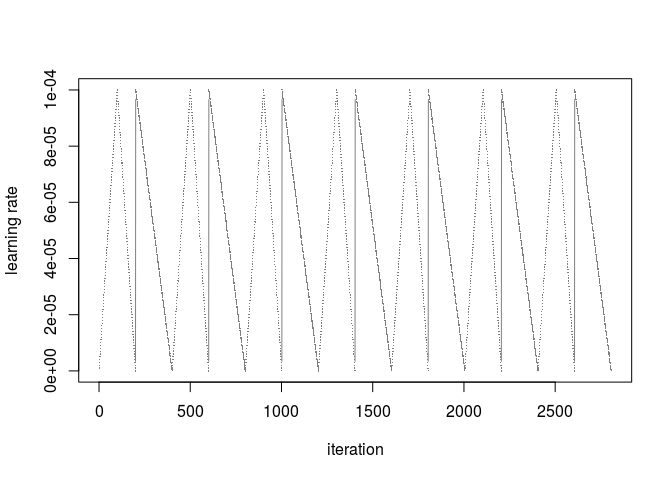
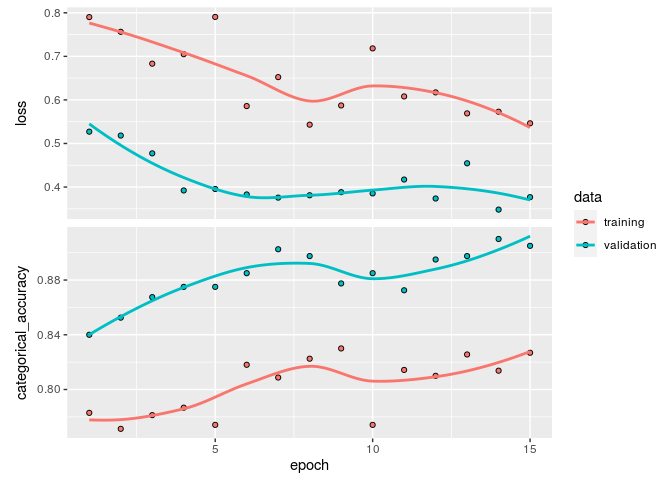

Fine tuning of models
================
Etienne Rolland
03/05/2020

# Fine tuning for layer 4

In this rmarkdown document I try some additionnal fine tuning of the
models produced the fine-tune notebook. Most of the choice of
architecture and parameters are wrotte in the other notebook. Most of
the code is hidded because of its
    redundancy.

    ## ── Attaching packages ────────────────────────────────────────────────────────────────────────────────────────────────── tidyverse 1.3.0 ──

    ## ✓ ggplot2 3.3.0     ✓ purrr   0.3.4
    ## ✓ tibble  3.0.1     ✓ dplyr   0.8.5
    ## ✓ tidyr   1.0.2     ✓ stringr 1.4.0
    ## ✓ readr   1.3.1     ✓ forcats 0.5.0

    ## ── Conflicts ───────────────────────────────────────────────────────────────────────────────────────────────────── tidyverse_conflicts() ──
    ## x dplyr::filter() masks stats::filter()
    ## x dplyr::lag()    masks stats::lag()

# Data augmentation and train generator

    ## Parsed with column specification:
    ## cols(
    ##   image_id = col_character(),
    ##   healthy = col_double(),
    ##   multiple_diseases = col_double(),
    ##   rust = col_double(),
    ##   scab = col_double()
    ## )

    ## # A tibble: 6 x 5
    ##   image_id healthy multiple_diseases  rust  scab
    ##   <chr>      <dbl>             <dbl> <dbl> <dbl>
    ## 1 Train_0        0                 0     0     1
    ## 2 Train_1        0                 1     0     0
    ## 3 Train_2        1                 0     0     0
    ## 4 Train_3        0                 0     1     0
    ## 5 Train_4        1                 0     0     0
    ## 6 Train_5        1                 0     0     0

    ## # A tibble: 6 x 5
    ##   image_id    healthy multiple_diseases  rust  scab
    ##   <chr>         <dbl>             <dbl> <dbl> <dbl>
    ## 1 Train_0.jpg       0                 0     0     1
    ## 2 Train_1.jpg       0                 1     0     0
    ## 3 Train_2.jpg       1                 0     0     0
    ## 4 Train_3.jpg       0                 0     1     0
    ## 5 Train_4.jpg       1                 0     0     0
    ## 6 Train_5.jpg       1                 0     0     0

    ## # A tibble: 6 x 5
    ##   image_id       healthy multiple_diseases  rust  scab
    ##   <chr>            <dbl>             <dbl> <dbl> <dbl>
    ## 1 Train_820.jpg        0                 0     0     1
    ## 2 Train_9.jpg          1                 0     0     0
    ## 3 Train_940.jpg        0                 0     1     0
    ## 4 Train_333.jpg        0                 0     1     0
    ## 5 Train_1719.jpg       0                 0     0     1
    ## 6 Train_611.jpg        0                 0     1     0

    ## # A tibble: 6 x 5
    ##   image_id     healthy multiple_diseases  rust  scab
    ##   <chr>          <dbl>             <dbl> <dbl> <dbl>
    ## 1 Train_2.jpg        1                 0     0     0
    ## 2 Train_16.jpg       0                 0     0     1
    ## 3 Train_19.jpg       0                 0     0     1
    ## 4 Train_21.jpg       0                 0     1     0
    ## 5 Train_22.jpg       0                 0     0     1
    ## 6 Train_27.jpg       0                 0     0     1

    ##    image_id            healthy       multiple_diseases      rust       
    ##  Length:1457        Min.   :0.0000   Min.   :0.00000   Min.   :0.0000  
    ##  Class :character   1st Qu.:0.0000   1st Qu.:0.00000   1st Qu.:0.0000  
    ##  Mode  :character   Median :0.0000   Median :0.00000   Median :0.0000  
    ##                     Mean   :0.2773   Mean   :0.04667   Mean   :0.3439  
    ##                     3rd Qu.:1.0000   3rd Qu.:0.00000   3rd Qu.:1.0000  
    ##                     Max.   :1.0000   Max.   :1.00000   Max.   :1.0000  
    ##       scab       
    ##  Min.   :0.0000  
    ##  1st Qu.:0.0000  
    ##  Median :0.0000  
    ##  Mean   :0.3322  
    ##  3rd Qu.:1.0000  
    ##  Max.   :1.0000

    ##    image_id            healthy       multiple_diseases      rust       
    ##  Length:364         Min.   :0.0000   Min.   :0.00000   Min.   :0.0000  
    ##  Class :character   1st Qu.:0.0000   1st Qu.:0.00000   1st Qu.:0.0000  
    ##  Mode  :character   Median :0.0000   Median :0.00000   Median :0.0000  
    ##                     Mean   :0.3077   Mean   :0.06319   Mean   :0.3324  
    ##                     3rd Qu.:1.0000   3rd Qu.:0.00000   3rd Qu.:1.0000  
    ##                     Max.   :1.0000   Max.   :1.00000   Max.   :1.0000  
    ##       scab       
    ##  Min.   :0.0000  
    ##  1st Qu.:0.0000  
    ##  Median :0.0000  
    ##  Mean   :0.2967  
    ##  3rd Qu.:1.0000  
    ##  Max.   :1.0000

    ## python:         /usr/bin/python3.5
    ## libpython:      /usr/lib/python3.5/config-3.5m-x86_64-linux-gnu/libpython3.5m.so
    ## pythonhome:     //usr://usr
    ## version:        3.5.2 (default, Apr 16 2020, 17:47:17)  [GCC 5.4.0 20160609]
    ## numpy:          /home/proprietaire/.local/lib/python3.5/site-packages/numpy
    ## numpy_version:  1.18.3
    ## tensorflow:     /home/proprietaire/.local/lib/python3.5/site-packages/tensorflow
    ## 
    ## NOTE: Python version was forced by use_python function

Plotting to see if it works :

<!-- -->

    ## <keras_preprocessing.image.dataframe_iterator.DataFrameIterator>

    ## List of 2
    ##  $ : num [1:4, 1:448, 1:448, 1:3] 72.3 81.5 103.6 159.5 93.9 ...
    ##  $ : num [1:4, 1:4] 1 0 0 1 0 0 0 0 0 0 ...

# Impot pre-trained model

Most of the details are described in the other Rmd document that
produced this
    weights.

    ## ________________________________________________________________________________
    ## Layer (type)              Output Shape      Param #  Connected to               
    ## ================================================================================
    ## input_1 (InputLayer)      (None, 448, 448,  0                                   
    ## ________________________________________________________________________________
    ## conv1_pad (ZeroPadding2D) (None, 454, 454,  0        input_1[0][0]              
    ## ________________________________________________________________________________
    ## conv1 (Conv2D)            (None, 224, 224,  9472     conv1_pad[0][0]            
    ## ________________________________________________________________________________
    ## bn_conv1 (BatchNormalizat (None, 224, 224,  256      conv1[0][0]                
    ## ________________________________________________________________________________
    ## activation_1 (Activation) (None, 224, 224,  0        bn_conv1[0][0]             
    ## ________________________________________________________________________________
    ## pool1_pad (ZeroPadding2D) (None, 226, 226,  0        activation_1[0][0]         
    ## ________________________________________________________________________________
    ## max_pooling2d_1 (MaxPooli (None, 112, 112,  0        pool1_pad[0][0]            
    ## ________________________________________________________________________________
    ## res2a_branch2a (Conv2D)   (None, 112, 112,  4160     max_pooling2d_1[0][0]      
    ## ________________________________________________________________________________
    ## bn2a_branch2a (BatchNorma (None, 112, 112,  256      res2a_branch2a[0][0]       
    ## ________________________________________________________________________________
    ## activation_2 (Activation) (None, 112, 112,  0        bn2a_branch2a[0][0]        
    ## ________________________________________________________________________________
    ## res2a_branch2b (Conv2D)   (None, 112, 112,  36928    activation_2[0][0]         
    ## ________________________________________________________________________________
    ## bn2a_branch2b (BatchNorma (None, 112, 112,  256      res2a_branch2b[0][0]       
    ## ________________________________________________________________________________
    ## activation_3 (Activation) (None, 112, 112,  0        bn2a_branch2b[0][0]        
    ## ________________________________________________________________________________
    ## res2a_branch2c (Conv2D)   (None, 112, 112,  16640    activation_3[0][0]         
    ## ________________________________________________________________________________
    ## res2a_branch1 (Conv2D)    (None, 112, 112,  16640    max_pooling2d_1[0][0]      
    ## ________________________________________________________________________________
    ## bn2a_branch2c (BatchNorma (None, 112, 112,  1024     res2a_branch2c[0][0]       
    ## ________________________________________________________________________________
    ## bn2a_branch1 (BatchNormal (None, 112, 112,  1024     res2a_branch1[0][0]        
    ## ________________________________________________________________________________
    ## add_1 (Add)               (None, 112, 112,  0        bn2a_branch2c[0][0]        
    ##                                                      bn2a_branch1[0][0]         
    ## ________________________________________________________________________________
    ## activation_4 (Activation) (None, 112, 112,  0        add_1[0][0]                
    ## ________________________________________________________________________________
    ## res2b_branch2a (Conv2D)   (None, 112, 112,  16448    activation_4[0][0]         
    ## ________________________________________________________________________________
    ## bn2b_branch2a (BatchNorma (None, 112, 112,  256      res2b_branch2a[0][0]       
    ## ________________________________________________________________________________
    ## activation_5 (Activation) (None, 112, 112,  0        bn2b_branch2a[0][0]        
    ## ________________________________________________________________________________
    ## res2b_branch2b (Conv2D)   (None, 112, 112,  36928    activation_5[0][0]         
    ## ________________________________________________________________________________
    ## bn2b_branch2b (BatchNorma (None, 112, 112,  256      res2b_branch2b[0][0]       
    ## ________________________________________________________________________________
    ## activation_6 (Activation) (None, 112, 112,  0        bn2b_branch2b[0][0]        
    ## ________________________________________________________________________________
    ## res2b_branch2c (Conv2D)   (None, 112, 112,  16640    activation_6[0][0]         
    ## ________________________________________________________________________________
    ## bn2b_branch2c (BatchNorma (None, 112, 112,  1024     res2b_branch2c[0][0]       
    ## ________________________________________________________________________________
    ## add_2 (Add)               (None, 112, 112,  0        bn2b_branch2c[0][0]        
    ##                                                      activation_4[0][0]         
    ## ________________________________________________________________________________
    ## activation_7 (Activation) (None, 112, 112,  0        add_2[0][0]                
    ## ________________________________________________________________________________
    ## res2c_branch2a (Conv2D)   (None, 112, 112,  16448    activation_7[0][0]         
    ## ________________________________________________________________________________
    ## bn2c_branch2a (BatchNorma (None, 112, 112,  256      res2c_branch2a[0][0]       
    ## ________________________________________________________________________________
    ## activation_8 (Activation) (None, 112, 112,  0        bn2c_branch2a[0][0]        
    ## ________________________________________________________________________________
    ## res2c_branch2b (Conv2D)   (None, 112, 112,  36928    activation_8[0][0]         
    ## ________________________________________________________________________________
    ## bn2c_branch2b (BatchNorma (None, 112, 112,  256      res2c_branch2b[0][0]       
    ## ________________________________________________________________________________
    ## activation_9 (Activation) (None, 112, 112,  0        bn2c_branch2b[0][0]        
    ## ________________________________________________________________________________
    ## res2c_branch2c (Conv2D)   (None, 112, 112,  16640    activation_9[0][0]         
    ## ________________________________________________________________________________
    ## bn2c_branch2c (BatchNorma (None, 112, 112,  1024     res2c_branch2c[0][0]       
    ## ________________________________________________________________________________
    ## add_3 (Add)               (None, 112, 112,  0        bn2c_branch2c[0][0]        
    ##                                                      activation_7[0][0]         
    ## ________________________________________________________________________________
    ## activation_10 (Activation (None, 112, 112,  0        add_3[0][0]                
    ## ________________________________________________________________________________
    ## res3a_branch2a (Conv2D)   (None, 56, 56, 12 32896    activation_10[0][0]        
    ## ________________________________________________________________________________
    ## bn3a_branch2a (BatchNorma (None, 56, 56, 12 512      res3a_branch2a[0][0]       
    ## ________________________________________________________________________________
    ## activation_11 (Activation (None, 56, 56, 12 0        bn3a_branch2a[0][0]        
    ## ________________________________________________________________________________
    ## res3a_branch2b (Conv2D)   (None, 56, 56, 12 147584   activation_11[0][0]        
    ## ________________________________________________________________________________
    ## bn3a_branch2b (BatchNorma (None, 56, 56, 12 512      res3a_branch2b[0][0]       
    ## ________________________________________________________________________________
    ## activation_12 (Activation (None, 56, 56, 12 0        bn3a_branch2b[0][0]        
    ## ________________________________________________________________________________
    ## res3a_branch2c (Conv2D)   (None, 56, 56, 51 66048    activation_12[0][0]        
    ## ________________________________________________________________________________
    ## res3a_branch1 (Conv2D)    (None, 56, 56, 51 131584   activation_10[0][0]        
    ## ________________________________________________________________________________
    ## bn3a_branch2c (BatchNorma (None, 56, 56, 51 2048     res3a_branch2c[0][0]       
    ## ________________________________________________________________________________
    ## bn3a_branch1 (BatchNormal (None, 56, 56, 51 2048     res3a_branch1[0][0]        
    ## ________________________________________________________________________________
    ## add_4 (Add)               (None, 56, 56, 51 0        bn3a_branch2c[0][0]        
    ##                                                      bn3a_branch1[0][0]         
    ## ________________________________________________________________________________
    ## activation_13 (Activation (None, 56, 56, 51 0        add_4[0][0]                
    ## ________________________________________________________________________________
    ## res3b_branch2a (Conv2D)   (None, 56, 56, 12 65664    activation_13[0][0]        
    ## ________________________________________________________________________________
    ## bn3b_branch2a (BatchNorma (None, 56, 56, 12 512      res3b_branch2a[0][0]       
    ## ________________________________________________________________________________
    ## activation_14 (Activation (None, 56, 56, 12 0        bn3b_branch2a[0][0]        
    ## ________________________________________________________________________________
    ## res3b_branch2b (Conv2D)   (None, 56, 56, 12 147584   activation_14[0][0]        
    ## ________________________________________________________________________________
    ## bn3b_branch2b (BatchNorma (None, 56, 56, 12 512      res3b_branch2b[0][0]       
    ## ________________________________________________________________________________
    ## activation_15 (Activation (None, 56, 56, 12 0        bn3b_branch2b[0][0]        
    ## ________________________________________________________________________________
    ## res3b_branch2c (Conv2D)   (None, 56, 56, 51 66048    activation_15[0][0]        
    ## ________________________________________________________________________________
    ## bn3b_branch2c (BatchNorma (None, 56, 56, 51 2048     res3b_branch2c[0][0]       
    ## ________________________________________________________________________________
    ## add_5 (Add)               (None, 56, 56, 51 0        bn3b_branch2c[0][0]        
    ##                                                      activation_13[0][0]        
    ## ________________________________________________________________________________
    ## activation_16 (Activation (None, 56, 56, 51 0        add_5[0][0]                
    ## ________________________________________________________________________________
    ## res3c_branch2a (Conv2D)   (None, 56, 56, 12 65664    activation_16[0][0]        
    ## ________________________________________________________________________________
    ## bn3c_branch2a (BatchNorma (None, 56, 56, 12 512      res3c_branch2a[0][0]       
    ## ________________________________________________________________________________
    ## activation_17 (Activation (None, 56, 56, 12 0        bn3c_branch2a[0][0]        
    ## ________________________________________________________________________________
    ## res3c_branch2b (Conv2D)   (None, 56, 56, 12 147584   activation_17[0][0]        
    ## ________________________________________________________________________________
    ## bn3c_branch2b (BatchNorma (None, 56, 56, 12 512      res3c_branch2b[0][0]       
    ## ________________________________________________________________________________
    ## activation_18 (Activation (None, 56, 56, 12 0        bn3c_branch2b[0][0]        
    ## ________________________________________________________________________________
    ## res3c_branch2c (Conv2D)   (None, 56, 56, 51 66048    activation_18[0][0]        
    ## ________________________________________________________________________________
    ## bn3c_branch2c (BatchNorma (None, 56, 56, 51 2048     res3c_branch2c[0][0]       
    ## ________________________________________________________________________________
    ## add_6 (Add)               (None, 56, 56, 51 0        bn3c_branch2c[0][0]        
    ##                                                      activation_16[0][0]        
    ## ________________________________________________________________________________
    ## activation_19 (Activation (None, 56, 56, 51 0        add_6[0][0]                
    ## ________________________________________________________________________________
    ## res3d_branch2a (Conv2D)   (None, 56, 56, 12 65664    activation_19[0][0]        
    ## ________________________________________________________________________________
    ## bn3d_branch2a (BatchNorma (None, 56, 56, 12 512      res3d_branch2a[0][0]       
    ## ________________________________________________________________________________
    ## activation_20 (Activation (None, 56, 56, 12 0        bn3d_branch2a[0][0]        
    ## ________________________________________________________________________________
    ## res3d_branch2b (Conv2D)   (None, 56, 56, 12 147584   activation_20[0][0]        
    ## ________________________________________________________________________________
    ## bn3d_branch2b (BatchNorma (None, 56, 56, 12 512      res3d_branch2b[0][0]       
    ## ________________________________________________________________________________
    ## activation_21 (Activation (None, 56, 56, 12 0        bn3d_branch2b[0][0]        
    ## ________________________________________________________________________________
    ## res3d_branch2c (Conv2D)   (None, 56, 56, 51 66048    activation_21[0][0]        
    ## ________________________________________________________________________________
    ## bn3d_branch2c (BatchNorma (None, 56, 56, 51 2048     res3d_branch2c[0][0]       
    ## ________________________________________________________________________________
    ## add_7 (Add)               (None, 56, 56, 51 0        bn3d_branch2c[0][0]        
    ##                                                      activation_19[0][0]        
    ## ________________________________________________________________________________
    ## activation_22 (Activation (None, 56, 56, 51 0        add_7[0][0]                
    ## ________________________________________________________________________________
    ## res4a_branch2a (Conv2D)   (None, 28, 28, 25 131328   activation_22[0][0]        
    ## ________________________________________________________________________________
    ## bn4a_branch2a (BatchNorma (None, 28, 28, 25 1024     res4a_branch2a[0][0]       
    ## ________________________________________________________________________________
    ## activation_23 (Activation (None, 28, 28, 25 0        bn4a_branch2a[0][0]        
    ## ________________________________________________________________________________
    ## res4a_branch2b (Conv2D)   (None, 28, 28, 25 590080   activation_23[0][0]        
    ## ________________________________________________________________________________
    ## bn4a_branch2b (BatchNorma (None, 28, 28, 25 1024     res4a_branch2b[0][0]       
    ## ________________________________________________________________________________
    ## activation_24 (Activation (None, 28, 28, 25 0        bn4a_branch2b[0][0]        
    ## ________________________________________________________________________________
    ## res4a_branch2c (Conv2D)   (None, 28, 28, 10 263168   activation_24[0][0]        
    ## ________________________________________________________________________________
    ## res4a_branch1 (Conv2D)    (None, 28, 28, 10 525312   activation_22[0][0]        
    ## ________________________________________________________________________________
    ## bn4a_branch2c (BatchNorma (None, 28, 28, 10 4096     res4a_branch2c[0][0]       
    ## ________________________________________________________________________________
    ## bn4a_branch1 (BatchNormal (None, 28, 28, 10 4096     res4a_branch1[0][0]        
    ## ________________________________________________________________________________
    ## add_8 (Add)               (None, 28, 28, 10 0        bn4a_branch2c[0][0]        
    ##                                                      bn4a_branch1[0][0]         
    ## ________________________________________________________________________________
    ## activation_25 (Activation (None, 28, 28, 10 0        add_8[0][0]                
    ## ________________________________________________________________________________
    ## res4b_branch2a (Conv2D)   (None, 28, 28, 25 262400   activation_25[0][0]        
    ## ________________________________________________________________________________
    ## bn4b_branch2a (BatchNorma (None, 28, 28, 25 1024     res4b_branch2a[0][0]       
    ## ________________________________________________________________________________
    ## activation_26 (Activation (None, 28, 28, 25 0        bn4b_branch2a[0][0]        
    ## ________________________________________________________________________________
    ## res4b_branch2b (Conv2D)   (None, 28, 28, 25 590080   activation_26[0][0]        
    ## ________________________________________________________________________________
    ## bn4b_branch2b (BatchNorma (None, 28, 28, 25 1024     res4b_branch2b[0][0]       
    ## ________________________________________________________________________________
    ## activation_27 (Activation (None, 28, 28, 25 0        bn4b_branch2b[0][0]        
    ## ________________________________________________________________________________
    ## res4b_branch2c (Conv2D)   (None, 28, 28, 10 263168   activation_27[0][0]        
    ## ________________________________________________________________________________
    ## bn4b_branch2c (BatchNorma (None, 28, 28, 10 4096     res4b_branch2c[0][0]       
    ## ________________________________________________________________________________
    ## add_9 (Add)               (None, 28, 28, 10 0        bn4b_branch2c[0][0]        
    ##                                                      activation_25[0][0]        
    ## ________________________________________________________________________________
    ## activation_28 (Activation (None, 28, 28, 10 0        add_9[0][0]                
    ## ________________________________________________________________________________
    ## res4c_branch2a (Conv2D)   (None, 28, 28, 25 262400   activation_28[0][0]        
    ## ________________________________________________________________________________
    ## bn4c_branch2a (BatchNorma (None, 28, 28, 25 1024     res4c_branch2a[0][0]       
    ## ________________________________________________________________________________
    ## activation_29 (Activation (None, 28, 28, 25 0        bn4c_branch2a[0][0]        
    ## ________________________________________________________________________________
    ## res4c_branch2b (Conv2D)   (None, 28, 28, 25 590080   activation_29[0][0]        
    ## ________________________________________________________________________________
    ## bn4c_branch2b (BatchNorma (None, 28, 28, 25 1024     res4c_branch2b[0][0]       
    ## ________________________________________________________________________________
    ## activation_30 (Activation (None, 28, 28, 25 0        bn4c_branch2b[0][0]        
    ## ________________________________________________________________________________
    ## res4c_branch2c (Conv2D)   (None, 28, 28, 10 263168   activation_30[0][0]        
    ## ________________________________________________________________________________
    ## bn4c_branch2c (BatchNorma (None, 28, 28, 10 4096     res4c_branch2c[0][0]       
    ## ________________________________________________________________________________
    ## add_10 (Add)              (None, 28, 28, 10 0        bn4c_branch2c[0][0]        
    ##                                                      activation_28[0][0]        
    ## ________________________________________________________________________________
    ## activation_31 (Activation (None, 28, 28, 10 0        add_10[0][0]               
    ## ________________________________________________________________________________
    ## res4d_branch2a (Conv2D)   (None, 28, 28, 25 262400   activation_31[0][0]        
    ## ________________________________________________________________________________
    ## bn4d_branch2a (BatchNorma (None, 28, 28, 25 1024     res4d_branch2a[0][0]       
    ## ________________________________________________________________________________
    ## activation_32 (Activation (None, 28, 28, 25 0        bn4d_branch2a[0][0]        
    ## ________________________________________________________________________________
    ## res4d_branch2b (Conv2D)   (None, 28, 28, 25 590080   activation_32[0][0]        
    ## ________________________________________________________________________________
    ## bn4d_branch2b (BatchNorma (None, 28, 28, 25 1024     res4d_branch2b[0][0]       
    ## ________________________________________________________________________________
    ## activation_33 (Activation (None, 28, 28, 25 0        bn4d_branch2b[0][0]        
    ## ________________________________________________________________________________
    ## res4d_branch2c (Conv2D)   (None, 28, 28, 10 263168   activation_33[0][0]        
    ## ________________________________________________________________________________
    ## bn4d_branch2c (BatchNorma (None, 28, 28, 10 4096     res4d_branch2c[0][0]       
    ## ________________________________________________________________________________
    ## add_11 (Add)              (None, 28, 28, 10 0        bn4d_branch2c[0][0]        
    ##                                                      activation_31[0][0]        
    ## ________________________________________________________________________________
    ## activation_34 (Activation (None, 28, 28, 10 0        add_11[0][0]               
    ## ________________________________________________________________________________
    ## res4e_branch2a (Conv2D)   (None, 28, 28, 25 262400   activation_34[0][0]        
    ## ________________________________________________________________________________
    ## bn4e_branch2a (BatchNorma (None, 28, 28, 25 1024     res4e_branch2a[0][0]       
    ## ________________________________________________________________________________
    ## activation_35 (Activation (None, 28, 28, 25 0        bn4e_branch2a[0][0]        
    ## ________________________________________________________________________________
    ## res4e_branch2b (Conv2D)   (None, 28, 28, 25 590080   activation_35[0][0]        
    ## ________________________________________________________________________________
    ## bn4e_branch2b (BatchNorma (None, 28, 28, 25 1024     res4e_branch2b[0][0]       
    ## ________________________________________________________________________________
    ## activation_36 (Activation (None, 28, 28, 25 0        bn4e_branch2b[0][0]        
    ## ________________________________________________________________________________
    ## res4e_branch2c (Conv2D)   (None, 28, 28, 10 263168   activation_36[0][0]        
    ## ________________________________________________________________________________
    ## bn4e_branch2c (BatchNorma (None, 28, 28, 10 4096     res4e_branch2c[0][0]       
    ## ________________________________________________________________________________
    ## add_12 (Add)              (None, 28, 28, 10 0        bn4e_branch2c[0][0]        
    ##                                                      activation_34[0][0]        
    ## ________________________________________________________________________________
    ## activation_37 (Activation (None, 28, 28, 10 0        add_12[0][0]               
    ## ________________________________________________________________________________
    ## res4f_branch2a (Conv2D)   (None, 28, 28, 25 262400   activation_37[0][0]        
    ## ________________________________________________________________________________
    ## bn4f_branch2a (BatchNorma (None, 28, 28, 25 1024     res4f_branch2a[0][0]       
    ## ________________________________________________________________________________
    ## activation_38 (Activation (None, 28, 28, 25 0        bn4f_branch2a[0][0]        
    ## ________________________________________________________________________________
    ## res4f_branch2b (Conv2D)   (None, 28, 28, 25 590080   activation_38[0][0]        
    ## ________________________________________________________________________________
    ## bn4f_branch2b (BatchNorma (None, 28, 28, 25 1024     res4f_branch2b[0][0]       
    ## ________________________________________________________________________________
    ## activation_39 (Activation (None, 28, 28, 25 0        bn4f_branch2b[0][0]        
    ## ________________________________________________________________________________
    ## res4f_branch2c (Conv2D)   (None, 28, 28, 10 263168   activation_39[0][0]        
    ## ________________________________________________________________________________
    ## bn4f_branch2c (BatchNorma (None, 28, 28, 10 4096     res4f_branch2c[0][0]       
    ## ________________________________________________________________________________
    ## add_13 (Add)              (None, 28, 28, 10 0        bn4f_branch2c[0][0]        
    ##                                                      activation_37[0][0]        
    ## ________________________________________________________________________________
    ## activation_40 (Activation (None, 28, 28, 10 0        add_13[0][0]               
    ## ________________________________________________________________________________
    ## res5a_branch2a (Conv2D)   (None, 14, 14, 51 524800   activation_40[0][0]        
    ## ________________________________________________________________________________
    ## bn5a_branch2a (BatchNorma (None, 14, 14, 51 2048     res5a_branch2a[0][0]       
    ## ________________________________________________________________________________
    ## activation_41 (Activation (None, 14, 14, 51 0        bn5a_branch2a[0][0]        
    ## ________________________________________________________________________________
    ## res5a_branch2b (Conv2D)   (None, 14, 14, 51 2359808  activation_41[0][0]        
    ## ________________________________________________________________________________
    ## bn5a_branch2b (BatchNorma (None, 14, 14, 51 2048     res5a_branch2b[0][0]       
    ## ________________________________________________________________________________
    ## activation_42 (Activation (None, 14, 14, 51 0        bn5a_branch2b[0][0]        
    ## ________________________________________________________________________________
    ## res5a_branch2c (Conv2D)   (None, 14, 14, 20 1050624  activation_42[0][0]        
    ## ________________________________________________________________________________
    ## res5a_branch1 (Conv2D)    (None, 14, 14, 20 2099200  activation_40[0][0]        
    ## ________________________________________________________________________________
    ## bn5a_branch2c (BatchNorma (None, 14, 14, 20 8192     res5a_branch2c[0][0]       
    ## ________________________________________________________________________________
    ## bn5a_branch1 (BatchNormal (None, 14, 14, 20 8192     res5a_branch1[0][0]        
    ## ________________________________________________________________________________
    ## add_14 (Add)              (None, 14, 14, 20 0        bn5a_branch2c[0][0]        
    ##                                                      bn5a_branch1[0][0]         
    ## ________________________________________________________________________________
    ## activation_43 (Activation (None, 14, 14, 20 0        add_14[0][0]               
    ## ________________________________________________________________________________
    ## res5b_branch2a (Conv2D)   (None, 14, 14, 51 1049088  activation_43[0][0]        
    ## ________________________________________________________________________________
    ## bn5b_branch2a (BatchNorma (None, 14, 14, 51 2048     res5b_branch2a[0][0]       
    ## ________________________________________________________________________________
    ## activation_44 (Activation (None, 14, 14, 51 0        bn5b_branch2a[0][0]        
    ## ________________________________________________________________________________
    ## res5b_branch2b (Conv2D)   (None, 14, 14, 51 2359808  activation_44[0][0]        
    ## ________________________________________________________________________________
    ## bn5b_branch2b (BatchNorma (None, 14, 14, 51 2048     res5b_branch2b[0][0]       
    ## ________________________________________________________________________________
    ## activation_45 (Activation (None, 14, 14, 51 0        bn5b_branch2b[0][0]        
    ## ________________________________________________________________________________
    ## res5b_branch2c (Conv2D)   (None, 14, 14, 20 1050624  activation_45[0][0]        
    ## ________________________________________________________________________________
    ## bn5b_branch2c (BatchNorma (None, 14, 14, 20 8192     res5b_branch2c[0][0]       
    ## ________________________________________________________________________________
    ## add_15 (Add)              (None, 14, 14, 20 0        bn5b_branch2c[0][0]        
    ##                                                      activation_43[0][0]        
    ## ________________________________________________________________________________
    ## activation_46 (Activation (None, 14, 14, 20 0        add_15[0][0]               
    ## ________________________________________________________________________________
    ## res5c_branch2a (Conv2D)   (None, 14, 14, 51 1049088  activation_46[0][0]        
    ## ________________________________________________________________________________
    ## bn5c_branch2a (BatchNorma (None, 14, 14, 51 2048     res5c_branch2a[0][0]       
    ## ________________________________________________________________________________
    ## activation_47 (Activation (None, 14, 14, 51 0        bn5c_branch2a[0][0]        
    ## ________________________________________________________________________________
    ## res5c_branch2b (Conv2D)   (None, 14, 14, 51 2359808  activation_47[0][0]        
    ## ________________________________________________________________________________
    ## bn5c_branch2b (BatchNorma (None, 14, 14, 51 2048     res5c_branch2b[0][0]       
    ## ________________________________________________________________________________
    ## activation_48 (Activation (None, 14, 14, 51 0        bn5c_branch2b[0][0]        
    ## ________________________________________________________________________________
    ## res5c_branch2c (Conv2D)   (None, 14, 14, 20 1050624  activation_48[0][0]        
    ## ________________________________________________________________________________
    ## bn5c_branch2c (BatchNorma (None, 14, 14, 20 8192     res5c_branch2c[0][0]       
    ## ________________________________________________________________________________
    ## add_16 (Add)              (None, 14, 14, 20 0        bn5c_branch2c[0][0]        
    ##                                                      activation_46[0][0]        
    ## ________________________________________________________________________________
    ## activation_49 (Activation (None, 14, 14, 20 0        add_16[0][0]               
    ## ================================================================================
    ## Total params: 23,587,712
    ## Trainable params: 23,534,592
    ## Non-trainable params: 53,120
    ## ________________________________________________________________________________

    ## Model
    ## ________________________________________________________________________________
    ## Layer (type)                        Output Shape                    Param #     
    ## ================================================================================
    ## resnet50 (Model)                    (None, 14, 14, 2048)            23587712    
    ## ________________________________________________________________________________
    ## global_max_pooling2d_1 (GlobalMaxPo (None, 2048)                    0           
    ## ________________________________________________________________________________
    ## batch_normalization_1 (BatchNormali (None, 2048)                    8192        
    ## ________________________________________________________________________________
    ## dropout_1 (Dropout)                 (None, 2048)                    0           
    ## ________________________________________________________________________________
    ## dense_1 (Dense)                     (None, 4)                       8196        
    ## ================================================================================
    ## Total params: 23,604,100
    ## Trainable params: 23,546,884
    ## Non-trainable params: 57,216
    ## ________________________________________________________________________________

## Loading the model

Following line is required to load the weights of the fine tuned model.

``` r
checkpoint_dir <- "fine_tuned_models/"

model %>% load_model_weights_hdf5(
  file.path(checkpoint_dir,"Fine_tuned_Resnet50_res5a_05.hdf5")
)
```

    ## ________________________________________________________________________________
    ## Layer (type)                        Output Shape                    Param #     
    ## ================================================================================
    ## resnet50 (Model)                    (None, 14, 14, 2048)            23587712    
    ## ________________________________________________________________________________
    ## global_max_pooling2d_1 (GlobalMaxPo (None, 2048)                    0           
    ## ________________________________________________________________________________
    ## batch_normalization_1 (BatchNormali (None, 2048)                    8192        
    ## ________________________________________________________________________________
    ## dropout_1 (Dropout)                 (None, 2048)                    0           
    ## ________________________________________________________________________________
    ## dense_1 (Dense)                     (None, 4)                       8196        
    ## ================================================================================
    ## Total params: 23,604,100
    ## Trainable params: 14,988,292
    ## Non-trainable params: 8,615,808
    ## ________________________________________________________________________________

## Unfreezing of the layer of interest

[See this link to
see](https://keras.rstudio.com/reference/freeze_layers.html) that it
works to unfreeze conv\_base independently of the sequential model. Here
I will try to unfreeze only the layer of
    interest.

    ## ________________________________________________________________________________
    ## Layer (type)                        Output Shape                    Param #     
    ## ================================================================================
    ## resnet50 (Model)                    (None, 14, 14, 2048)            23587712    
    ## ________________________________________________________________________________
    ## global_max_pooling2d_1 (GlobalMaxPo (None, 2048)                    0           
    ## ________________________________________________________________________________
    ## batch_normalization_1 (BatchNormali (None, 2048)                    8192        
    ## ________________________________________________________________________________
    ## dropout_1 (Dropout)                 (None, 2048)                    0           
    ## ________________________________________________________________________________
    ## dense_1 (Dense)                     (None, 4)                       8196        
    ## ================================================================================
    ## Total params: 23,604,100
    ## Trainable params: 22,096,900
    ## Non-trainable params: 1,507,200
    ## ________________________________________________________________________________

# Creation of the callback for the training :

# Cyclical learning rate

The lr max is set as the one used to train the head of the model,
divided by 10. Same for the base\_lr.

``` r
n=100
nb_epochs=15
n_iter<-n*nb_epochs
```

``` r
l_rate_cyclical <- Cyclic_LR(iteration=1:n, base_lr=1e-7, max_lr=(1e-3)/5, step_size=floor(n/2),
                        mode='triangular', gamma=1, scale_fn=NULL, scale_mode='cycle')


l_rate_cosine_annealing <- Cyclic_LR(iteration=1:n_iter, base_lr=1e-7, max_lr=(1e-3)/5, step_size=floor(n),
                        mode='halfcosine', gamma=1, scale_fn=NULL, scale_mode='cycle')

l_rate_cosine_annealing <- rep(l_rate_cosine_annealing[n:(n*2)])

l_rate <- rep(c(l_rate_cyclical, l_rate_cosine_annealing), nb_epochs/2)
```

<!-- -->

# Training

``` r
model %>% compile(
    optimizer=optimizer_rmsprop(lr=1e-5),
    loss="categorical_crossentropy",
    metrics='categorical_accuracy'
)
```

Save all the models :

``` r
checkpoint_dir <- "layer_4_models"
unlink(checkpoint_dir, recursive = TRUE)
dir.create(checkpoint_dir)
```

``` r
filepath <- file.path(checkpoint_dir, "Resnet50_res4a_{epoch:02d}.hdf5")

cp_callback <- callback_model_checkpoint(
  filepath = filepath,
  save_weights_only = TRUE,
  save_best_only = TRUE
)
```

    ## Warning in callback_model_checkpoint(filepath = filepath, save_weights_only
    ## = TRUE, : The save_freq argument is only used by TensorFlow >= 1.14. Update
    ## TensorFlow or use save_freq = NULL

``` r
callback_list<-list(callback_lr, #callback to update lr
                      cp_callback)
```

    ## `geom_smooth()` using formula 'y ~ x'

<!-- -->
