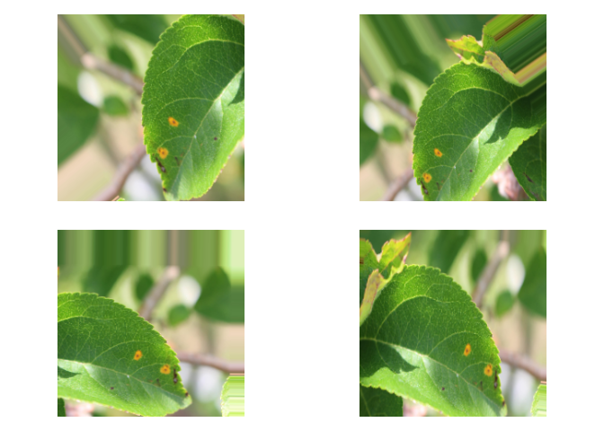

Fine tuning of models
================
Etienne Rolland
03/05/2020

# Fine tuning

In this rmarkdown document I try some additionnal training of module
produced by the others notebook. Most of the choise of architecture and
parameters are wrotte in the other notebook. Most of the code is hidded
because of its
    redundancy.

    ## ── Attaching packages ─────────────────────────────────────────────────────────────────────────────────────────────────────── tidyverse 1.3.0 ──

    ## ✓ ggplot2 3.3.0     ✓ purrr   0.3.4
    ## ✓ tibble  3.0.0     ✓ dplyr   0.8.5
    ## ✓ tidyr   1.0.2     ✓ stringr 1.4.0
    ## ✓ readr   1.3.1     ✓ forcats 0.5.0

    ## ── Conflicts ────────────────────────────────────────────────────────────────────────────────────────────────────────── tidyverse_conflicts() ──
    ## x dplyr::filter() masks stats::filter()
    ## x dplyr::lag()    masks stats::lag()

# Data augmentation and train generator

    ## Parsed with column specification:
    ## cols(
    ##   image_id = col_character(),
    ##   healthy = col_double(),
    ##   multiple_diseases = col_double(),
    ##   rust = col_double(),
    ##   scab = col_double()
    ## )

    ## # A tibble: 6 x 5
    ##   image_id healthy multiple_diseases  rust  scab
    ##   <chr>      <dbl>             <dbl> <dbl> <dbl>
    ## 1 Train_0        0                 0     0     1
    ## 2 Train_1        0                 1     0     0
    ## 3 Train_2        1                 0     0     0
    ## 4 Train_3        0                 0     1     0
    ## 5 Train_4        1                 0     0     0
    ## 6 Train_5        1                 0     0     0

    ## # A tibble: 6 x 5
    ##   image_id    healthy multiple_diseases  rust  scab
    ##   <chr>         <dbl>             <dbl> <dbl> <dbl>
    ## 1 Train_0.jpg       0                 0     0     1
    ## 2 Train_1.jpg       0                 1     0     0
    ## 3 Train_2.jpg       1                 0     0     0
    ## 4 Train_3.jpg       0                 0     1     0
    ## 5 Train_4.jpg       1                 0     0     0
    ## 6 Train_5.jpg       1                 0     0     0

    ## # A tibble: 6 x 5
    ##   image_id       healthy multiple_diseases  rust  scab
    ##   <chr>            <dbl>             <dbl> <dbl> <dbl>
    ## 1 Train_820.jpg        0                 0     0     1
    ## 2 Train_9.jpg          1                 0     0     0
    ## 3 Train_940.jpg        0                 0     1     0
    ## 4 Train_333.jpg        0                 0     1     0
    ## 5 Train_1719.jpg       0                 0     0     1
    ## 6 Train_611.jpg        0                 0     1     0

    ## # A tibble: 6 x 5
    ##   image_id     healthy multiple_diseases  rust  scab
    ##   <chr>          <dbl>             <dbl> <dbl> <dbl>
    ## 1 Train_2.jpg        1                 0     0     0
    ## 2 Train_19.jpg       0                 0     0     1
    ## 3 Train_22.jpg       0                 0     0     1
    ## 4 Train_31.jpg       0                 0     1     0
    ## 5 Train_33.jpg       1                 0     0     0
    ## 6 Train_38.jpg       0                 0     1     0

    ##    image_id            healthy       multiple_diseases      rust       
    ##  Length:1639        Min.   :0.0000   Min.   :0.00000   Min.   :0.0000  
    ##  Class :character   1st Qu.:0.0000   1st Qu.:0.00000   1st Qu.:0.0000  
    ##  Mode  :character   Median :0.0000   Median :0.00000   Median :0.0000  
    ##                     Mean   :0.2794   Mean   :0.05003   Mean   :0.3411  
    ##                     3rd Qu.:1.0000   3rd Qu.:0.00000   3rd Qu.:1.0000  
    ##                     Max.   :1.0000   Max.   :1.00000   Max.   :1.0000  
    ##       scab       
    ##  Min.   :0.0000  
    ##  1st Qu.:0.0000  
    ##  Median :0.0000  
    ##  Mean   :0.3295  
    ##  3rd Qu.:1.0000  
    ##  Max.   :1.0000

    ##    image_id            healthy       multiple_diseases      rust       
    ##  Length:182         Min.   :0.0000   Min.   :0.00000   Min.   :0.0000  
    ##  Class :character   1st Qu.:0.0000   1st Qu.:0.00000   1st Qu.:0.0000  
    ##  Mode  :character   Median :0.0000   Median :0.00000   Median :0.0000  
    ##                     Mean   :0.3187   Mean   :0.04945   Mean   :0.3462  
    ##                     3rd Qu.:1.0000   3rd Qu.:0.00000   3rd Qu.:1.0000  
    ##                     Max.   :1.0000   Max.   :1.00000   Max.   :1.0000  
    ##       scab       
    ##  Min.   :0.0000  
    ##  1st Qu.:0.0000  
    ##  Median :0.0000  
    ##  Mean   :0.2857  
    ##  3rd Qu.:1.0000  
    ##  Max.   :1.0000

    ## python:         /usr/bin/python3.5
    ## libpython:      /usr/lib/python3.5/config-3.5m-x86_64-linux-gnu/libpython3.5m.so
    ## pythonhome:     //usr://usr
    ## version:        3.5.2 (default, Apr 16 2020, 17:47:17)  [GCC 5.4.0 20160609]
    ## numpy:          /home/proprietaire/.local/lib/python3.5/site-packages/numpy
    ## numpy_version:  1.18.3
    ## tensorflow:     /home/proprietaire/.local/lib/python3.5/site-packages/tensorflow
    ## 
    ## NOTE: Python version was forced by use_python function

Plotting to see if it works :

<!-- -->

    ## <keras_preprocessing.image.dataframe_iterator.DataFrameIterator>

    ## List of 2
    ##  $ : num [1:32, 1:224, 1:224, 1:3] 69.5 95.8 210.3 196.4 96.7 ...
    ##  $ : num [1:32, 1:4] 1 1 1 0 1 0 0 0 0 0 ...

# Import pre-trained model

Most of the details are described in the other Rmd document that
produced this weights.

    ## Model
    ## ________________________________________________________________________________
    ## Layer (type)                        Output Shape                    Param #     
    ## ================================================================================
    ## resnet50 (Model)                    (None, 7, 7, 2048)              23587712    
    ## ________________________________________________________________________________
    ## global_max_pooling2d_1 (GlobalMaxPo (None, 2048)                    0           
    ## ________________________________________________________________________________
    ## batch_normalization_1 (BatchNormali (None, 2048)                    8192        
    ## ________________________________________________________________________________
    ## dropout_1 (Dropout)                 (None, 2048)                    0           
    ## ________________________________________________________________________________
    ## dense_1 (Dense)                     (None, 4)                       8196        
    ## ================================================================================
    ## Total params: 23,604,100
    ## Trainable params: 23,546,884
    ## Non-trainable params: 57,216
    ## ________________________________________________________________________________

## Unfreezing the model

Following line to got the name of the layer we want to unfreeze
(res5a\_branch2a)

[See this link to
see](https://keras.rstudio.com/reference/freeze_layers.html) that it
works to unfreeze conv\_base independently of the sequential
    model.

    ## ________________________________________________________________________________
    ## Layer (type)                        Output Shape                    Param #     
    ## ================================================================================
    ## resnet50 (Model)                    (None, 7, 7, 2048)              23587712    
    ## ________________________________________________________________________________
    ## global_max_pooling2d_1 (GlobalMaxPo (None, 2048)                    0           
    ## ________________________________________________________________________________
    ## batch_normalization_1 (BatchNormali (None, 2048)                    8192        
    ## ________________________________________________________________________________
    ## dropout_1 (Dropout)                 (None, 2048)                    0           
    ## ________________________________________________________________________________
    ## dense_1 (Dense)                     (None, 4)                       8196        
    ## ================================================================================
    ## Total params: 23,604,100
    ## Trainable params: 14,988,292
    ## Non-trainable params: 8,615,808
    ## ________________________________________________________________________________

# Creation of the callback for the training :

# Cyclical learning rate

The lr max is set as the one used to train the head of the model,
divided by 10. Same for the base\_lr.

``` r
n=4
nb_epochs=2
n_iter<-n*nb_epochs
```

``` r
l_rate_cyclical <- Cyclic_LR(iteration=1:n, base_lr=1e-6, max_lr=1e-4, step_size=floor(n/2),
                        mode='triangular', gamma=1, scale_fn=NULL, scale_mode='cycle')


l_rate_cosine_annealing <- Cyclic_LR(iteration=1:n_iter, base_lr=1e-6, max_lr=1e-4, step_size=floor(n),
                        mode='halfcosine', gamma=1, scale_fn=NULL, scale_mode='cycle')

l_rate_cosine_annealing <- rep(l_rate_cosine_annealing[n:(n*2)])

l_rate <- rep(c(l_rate_cyclical, l_rate_cosine_annealing), nb_epochs/2)
```

<!-- -->

## Training

``` r
model %>% compile(
    optimizer=optimizer_rmsprop(lr=1e-5),
    loss="binary_crossentropy",
    metrics = "accuracy"
)
```

Save all the models :

``` r
checkpoint_dir <- "fine_tuned_models"
unlink(checkpoint_dir, recursive = TRUE)
dir.create(checkpoint_dir)
```

``` r
filepath <- file.path(checkpoint_dir, "Fine_tuned_Resnet50_epoch_8_{epoch:02d}.hdf5")

cp_callback <- callback_model_checkpoint(
  filepath = filepath,
  save_weights_only = FALSE,
  verbose = 1
)
```

    ## Warning in callback_model_checkpoint(filepath = filepath, save_weights_only
    ## = FALSE, : The save_freq argument is only used by TensorFlow >= 1.14. Update
    ## TensorFlow or use save_freq = NULL

``` r
callback_list<-list(callback_lr, #callback to update lr
                      cp_callback)
```

<!-- -->

### Model from epoch 6, after some fine tuning :

``` r
model<-load_model_hdf5("checkpoints/Resnet50_from_epoch_6_02.hdf5")
```

``` r
model %>% compile(
    optimizer=optimizer_rmsprop(lr=1e-5),
    loss="binary_crossentropy",
    metrics = "accuracy"
)
```

``` r
filepath <- file.path(checkpoint_dir, "Fine_tuned_Resnet50_epoch_6_{epoch:02d}.hdf5")

cp_callback <- callback_model_checkpoint(
  filepath = filepath,
  save_weights_only = FALSE,
  verbose = 1
)
```

    ## Warning in callback_model_checkpoint(filepath = filepath, save_weights_only
    ## = FALSE, : The save_freq argument is only used by TensorFlow >= 1.14. Update
    ## TensorFlow or use save_freq = NULL

``` r
callback_list<-list(callback_lr, #callback to update lr
                      cp_callback)
```

<!-- -->
