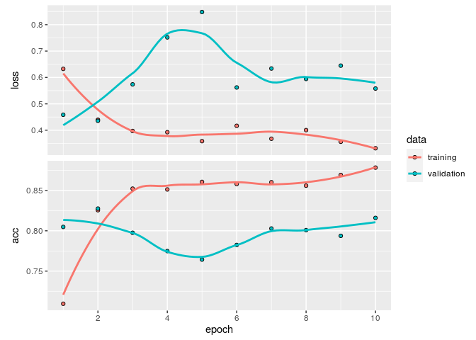

# Keras with R

Long ago, I have learned the basics of deep learning with keras. I got more used to Fast.ai since then.

But I am a R practitioner and I want to know a framework that I can use with R. Also, Keras is sometimes required explicity in some job offers/projects, or for academic research. So in this Rmarkdown document, I relearn it with the book *Deep Learning with R*. For the moment my aim is to have something that work from A to Z, and iterate over it.

The data of this Rmarkdown came from the competition [Plant Pathology 2020 - FGVC7](https://www.kaggle.com/c/plant-pathology-2020-fgvc7). In this notebook I also reimplement a learning rate finder and the one cycle policy.

## To do list :
* bigger images
* load best model after training :heavy_check_mark:
* lr finder :heavy_check_mark:
* add data augmentation :heavy_check_mark:
* plot the data augmentation :heavy_check_mark:
* implement one cycle policy ? :heavy_check_mark:
* visualization of what the convnets learn
* fine tuning

```{r}
library(tidyverse)
library(keras)
library(tensorflow)
library(reticulate)
```


```{r}
use_python("/usr/bin/python3.5", required = TRUE)
tf <- tensorflow::tf
sess <- tf$Session()
```


## Data augmentation and train generator

```{r}
labels<-read_csv('plant-pathology-2020-fgvc7/train.csv')
head(labels)
```

```{r}
labels$image_id <- paste0(labels$image_id, ".jpg")
```

```{r}
head(labels)
```

```{r}
set.seed(6)
```

```{r}
labels <- labels  %>% mutate(id = row_number())#Check IDs

train_labels <- labels  %>% sample_frac(.90)#Create test set
val_labels <- anti_join(labels, train_labels, by = 'id')
train_labels$id<-NULL
val_labels$id<-NULL
```

```{r}
head(train_labels)
```

```{r}
head(val_labels)
```

```{r}
summary(train_labels)
```

```{r}
summary(val_labels)
```

```{r}
image_path<-'plant-pathology-2020-fgvc7/images/'
```

```{r}
#reticulate::virtualenv_install(packages="pandas") 
```

```{r}
keras::use_implementation("keras")
keras::use_backend("tensorflow")

```

```{r}
reticulate::py_config()
```

```{r}
#data augmentation
datagen <- image_data_generator(
  rotation_range = 40,
  width_shift_range = 0.2,
  height_shift_range = 0.2,
  shear_range = 0.2,
  zoom_range = 0.2,
  horizontal_flip = TRUE,
  fill_mode = "nearest"
)
```

Plotting to see if it works :

```{r}
img_path<-"plant-pathology-2020-fgvc7/images/Train_1000.jpg"

img <- image_load(img_path, target_size = c(224, 224))
img_array <- image_to_array(img)
img_array <- array_reshape(img_array, c(1, 224, 224, 3))
img_array<-img_array/255
# Generated that will flow augmented images
augmentation_generator <- flow_images_from_data(
  img_array, 
  generator = datagen, 
  batch_size = 1 
)
op <- par(mfrow = c(2, 2), pty = "s", mar = c(1, 0, 1, 0))
for (i in 1:4) {
  batch <- generator_next(augmentation_generator)
  plot(as.raster(batch[1,,,]))
}
par(op)
```

```{r}
train_generator <- flow_images_from_dataframe(dataframe = train_labels, 
                                              directory = image_path,
                                              generator = datagen,
                                              class_mode = "other",
                                              x_col = "image_id",
                                              y_col = c("healthy", "multiple_diseases", "rust", "scab"),
                                              target_size = c(224, 224),
                                              batch_size=32)
```

```{r}
validation_generator <- flow_images_from_dataframe(dataframe = val_labels, 
                                              directory = image_path,
                                              class_mode = "other",
                                              x_col = "image_id",
                                              y_col = c("healthy", "multiple_diseases", "rust", "scab"),
                                              target_size = c(224, 224),
                                              batch_size=32)
```

```{r}
train_generator
```

```{r}
batch<-generator_next(train_generator)
str(batch)
```

# Import pre-trained model

How to choose the parameters ? c(224, 224, 3) is the default of Resnet, came from the default if include_top is set to true.

```{r}
conv_base <- application_resnet50(weights = 'imagenet', include_top = FALSE, input_shape = c(224, 224, 3))
```

```{r}
#conv_base
```


```{r}
freeze_weights(conv_base)
```

How to decide to what to add to the conv_base of a Resnet-50 ? Running the following allow to look what the Resnet looks like normally :

```{r}
#look <- application_resnet50(weights = 'imagenet', include_top = TRUE, input_shape = c(224, 224, 3))
#look

#________________________________________________________________________________
#conv5_block3_out (Activat (None, 7, 7, 2048 0        conv5_block3_add[0][0]     
#________________________________________________________________________________
#avg_pool (GlobalAveragePo (None, 2048)      0        conv5_block3_out[0][0]     
#________________________________________________________________________________
#probs (Dense)             (None, 1000)      2049000  avg_pool[0][0]             
#================================================================================
```

But it gave quite poor results. Actually I have tried to look in other kernels, without finding clear consensus. Finally I will add some layer in a similar way on [how it is done in fast_ai](https://docs.fast.ai/vision.learner.html#create_head). Since there is a "funny" pooling operation, The AdaptiveConcatPool2d (adaptive average pooling and adaptive max pooling), I will use a max pooling, because we are most interresting to know if there is a rust or scab, that something on “average”. 

One of the most important aspect of deep learning is to set up a good loss function and last layer activation. Since it is a **multiclass** and **multi-label** classification (plants can have several diseases), I will use a **sigmoid** activation for the last layer and a **binary crossentropy** as the loss function. 

```{r}
model <- keras_model_sequential() %>% 
        conv_base %>% 
        layer_global_max_pooling_2d() %>% 
        layer_batch_normalization() %>%
        layer_dropout(rate=0.5) %>%
        layer_dense(units=4, activation="sigmoid")
```

```{r}
model
```

## Learning rate finder

Keras force you to ask yourself a lot of question, including the good learning rate to use. I was not really successfull to do so, so I reimplement a learning rate finder, based on the code of this [excellent article](http://thecooldata.com/2019/01/learning-rate-finder-with-cifar10-keras-r/), but with some change for the the maths [of this article about fast.ai](https://sgugger.github.io/how-do-you-find-a-good-learning-rate.html) (for the different learning rate explored in the initial phase).

```{r}
LogMetrics <- R6::R6Class("LogMetrics",
  inherit = KerasCallback,
  public = list(
    loss = NULL,
    acc = NULL,
    on_batch_end = function(batch, logs=list()) {
      self$loss <- c(self$loss, logs[["loss"]])
      self$acc <- c(self$acc, logs[["acc"]])
    }
))
```

```{r}
callback_lr_init <- function(logs){
      iter <<- 0
      lr_hist <<- c()
      iter_hist <<- c()
}
callback_lr_set <- function(batch, logs){
      iter <<- iter + 1
      LR <- l_rate[iter] # if number of iterations > l_rate values, make LR constant to last value
      if(is.na(LR)) LR <- l_rate[length(l_rate)]
      k_set_value(model$optimizer$lr, LR)
}
callback_lr_log <- function(batch, logs){
      lr_hist <<- c(lr_hist, k_get_value(model$optimizer$lr))
      iter_hist <<- c(iter_hist, k_get_value(model$optimizer$iterations))
}
```

```{r}
callback_lr <- callback_lambda(on_train_begin=callback_lr_init, on_batch_begin=callback_lr_set)
callback_logger <- callback_lambda(on_batch_end=callback_lr_log)
callback_log_acc_lr <- LogMetrics$new()
```

After some successfull training for a learning rate between 1e-5 and 1e-3, I extend the plot to a maximum of 0.1.

```{r}
lr0<-1e-8
#lr_max<-0.01
lr_max<-0.1

#n_iteration :
n<-120 #from 100 to 120
q<-(lr_max/lr0)^(1/(n-1))
```

```{r}
i<-1:n
l_rate<-lr0*(q^i)
plot(l_rate, type="b", pch=16, cex=0.1, xlab="iteration", ylab="learning rate")
```


```{r}
model %>% compile(
    optimizer=optimizer_rmsprop(lr=lr_max),
    loss="binary_crossentropy",
    metrics='accuracy'
)
```

```{r}
callback_list = list(callback_lr, callback_logger, callback_log_acc_lr)
```

```{r}
history <- model %>% fit_generator(
    train_generator,
    steps_per_epoch=n,
    epochs = 1,
    callbacks = callback_list,
    validation_data = validation_generator,
    validation_step=30
)
```

```{r}
data <- data.frame("Learning_rate" = lr_hist, "Loss" = callback_log_acc_lr$loss)
head(data)
```

Learning rate vs loss :

```{r}
ggplot(data, aes(x=Learning_rate, y=Loss)) + scale_x_log10() + geom_point() +  geom_smooth(span = 0.5)
```

More centered on the moment when the slope goes down :

```{r}
limits<-quantile(data$Loss, probs = c(0.10, 0.90))
ggplot(data, aes(x=Learning_rate, y=Loss)) + scale_x_log10() + 
scale_y_continuous(name="Loss", limits=limits)+ geom_point() +  geom_smooth(span = 0.5)
```

Based on this graph I would go on a base_lr=1e-5, and a max lr of 1e-3.

# Training

## Training with cyclic lr

After the improvement of the performance the neural net (by setting the right loss/activation of the last layer), it is time to focus a bit on the cyclic Learning Rate. Most of the code below came [from the cool data](http://thecooldata.com/2019/01/learning-rate-finder-with-cifar10-keras-r/). In contrast to the previous version (mode='exp_range', gamma=0.99), I will first try follow the guidelines from [The 1cycle policy]( https://sgugger.github.io/the-1cycle-policy.html), by setting the learning rate into in a triangular mode (**NB**, without having the learning rate decreasing more than the minimum at the end of the cycle).

```{r}
####################
Cyclic_LR <- function(iteration=1:32000, base_lr=1e-5, max_lr=1e-3, step_size=2000, mode='triangular', gamma=1, scale_fn=NULL, scale_mode='cycle'){ # translated from python to R, original at: https://github.com/bckenstler/CLR/blob/master/clr_callback.py # This callback implements a cyclical learning rate policy (CLR). # The method cycles the learning rate between two boundaries with # some constant frequency, as detailed in this paper (https://arxiv.org/abs/1506.01186). # The amplitude of the cycle can be scaled on a per-iteration or per-cycle basis. # This class has three built-in policies, as put forth in the paper. # - "triangular": A basic triangular cycle w/ no amplitude scaling. # - "triangular2": A basic triangular cycle that scales initial amplitude by half each cycle. # - "exp_range": A cycle that scales initial amplitude by gamma**(cycle iterations) at each cycle iteration. # - "sinus": A sinusoidal form cycle # # Example # > clr <- Cyclic_LR(base_lr=0.001, max_lr=0.006, step_size=2000, mode='triangular', num_iterations=20000) # > plot(clr, cex=0.2)
 
      # Class also supports custom scaling functions with function output max value of 1:
      # > clr_fn <- function(x) 1/x # > clr <- Cyclic_LR(base_lr=0.001, max_lr=0.006, step_size=400, # scale_fn=clr_fn, scale_mode='cycle', num_iterations=20000) # > plot(clr, cex=0.2)
 
      # # Arguments
      #   iteration:
      #       if is a number:
      #           id of the iteration where: max iteration = epochs * (samples/batch)
      #       if "iteration" is a vector i.e.: iteration=1:10000:
      #           returns the whole sequence of lr as a vector
      #   base_lr: initial learning rate which is the
      #       lower boundary in the cycle.
      #   max_lr: upper boundary in the cycle. Functionally,
      #       it defines the cycle amplitude (max_lr - base_lr).
      #       The lr at any cycle is the sum of base_lr
      #       and some scaling of the amplitude; therefore 
      #       max_lr may not actually be reached depending on
      #       scaling function.
      #   step_size: number of training iterations per
      #       half cycle. Authors suggest setting step_size
      #       2-8 x training iterations in epoch.
      #   mode: one of {triangular, triangular2, exp_range, sinus}.
      #       Default 'triangular'.
      #       Values correspond to policies detailed above.
      #       If scale_fn is not None, this argument is ignored.
      #   gamma: constant in 'exp_range' scaling function:
      #       gamma**(cycle iterations)
      #   scale_fn: Custom scaling policy defined by a single
      #       argument lambda function, where 
      #       0 <= scale_fn(x) <= 1 for all x >= 0.
      #       mode paramater is ignored 
      #   scale_mode: {'cycle', 'iterations'}.
      #       Defines whether scale_fn is evaluated on 
      #       cycle number or cycle iterations (training
      #       iterations since start of cycle). Default is 'cycle'.
 
      ########
      if(is.null(scale_fn)==TRUE){
            if(mode=='triangular'){scale_fn <- function(x) 1; scale_mode <- 'cycle';}
            if(mode=='triangular2'){scale_fn <- function(x) 1/(2^(x-1)); scale_mode <- 'cycle';}
            if(mode=='exp_range'){scale_fn <- function(x) gamma^(x); scale_mode <- 'iterations';}
            if(mode=='sinus'){scale_fn <- function(x) 0.5*(1+sin(x*pi/2)); scale_mode <- 'cycle';}
            if(mode=='halfcosine'){scale_fn <- function(x) 0.5*(1+cos(x*pi)^2); scale_mode <- 'cycle';}
      }
      lr <- list()
      if(is.vector(iteration)==TRUE){
            for(iter in iteration){
                  cycle <- floor(1 + (iter / (2*step_size)))
                  x2 <- abs(iter/step_size-2 * cycle+1)
                  if(scale_mode=='cycle') x <- cycle
                  if(scale_mode=='iterations') x <- iter
                  lr[[iter]] <- base_lr + (max_lr-base_lr) * max(0,(1-x2)) * scale_fn(x)
            }
      }
      lr <- do.call("rbind",lr)
      return(as.vector(lr))
}
```

## Trying cosine annealing

```{r}
n=40
nb_epochs=10
n_iter<-n*nb_epochs
```

```{r}
l_rate <- Cyclic_LR(iteration=1:n_iter, base_lr=1e-5, max_lr=1e-3, step_size=floor(n/2),
                        mode='triangular', gamma=1, scale_fn=NULL, scale_mode='cycle')
```

```{r}
plot(l_rate, type="b", pch=16, xlab="iteration", cex=0.2, ylab="learning rate", col="grey50")
```


Clean model for training :

```{r}
model <- keras_model_sequential() %>% 
        conv_base %>% 
        layer_global_max_pooling_2d() %>% 
        layer_batch_normalization() %>%
        layer_dropout(rate=0.5) %>%
        layer_dense(units=4, activation="sigmoid")
```

```{r}
model %>% compile(
    optimizer=optimizer_rmsprop(lr=1e-5),
    loss="binary_crossentropy",
    metrics='accuracy'
)
```

```{r}
callback_list<-list(callback_lr, #callback to update lr
    callback_model_checkpoint(filepath = "raw_model.h5", monitor = "val_acc", save_best_only = TRUE ))
```

```{r}
history <- model %>% fit_generator(
    train_generator,
    steps_per_epoch=n,
    epochs = nb_epochs,
    callbacks = callback_list, #callback to update cylic lr
    validation_data = validation_generator,
    validation_step=50
)
```

```{r plot_perforance}
plot(history)
```


## Trying cosine annealing

```{r}
n=40
nb_epochs=5
n_iter<-n*nb_epochs
```

```{r}
l_rate <- Cyclic_LR(iteration=1:n_iter, base_lr=1e-5, max_lr=1e-3, step_size=floor(n),
                        mode='halfcosine', gamma=1, scale_fn=NULL, scale_mode='cycle')

l_rate <- rep(l_rate[n:(n*2)], nb_epochs)
```

```{r}
plot(l_rate, type="b", pch=16, xlab="iteration", cex=0.2, ylab="learning rate", col="grey50")
```

```{r}
history <- model %>% fit_generator(
    train_generator,
    steps_per_epoch=n,
    epochs = nb_epochs,
    callbacks = callback_list, #callback to update cylic lr
    validation_data = validation_generator,
    validation_step=50
)
```

```{r}
plot(history)
```

Load best model :

```{r}
#model<-load_model_hdf5("raw_model.h5")
```

### About the learning rate 

Based on the previous graph, I used a learning rate of 1e-3. The article [The 1cycle policy]( https://sgugger.github.io/the-1cycle-policy.html), mentionned that we can use a bigger learning rate as a regularizer, but a maximum learning rate of 5e-3 gave average results in my my previous attempt :



# Submit

```{r}
#test<-read_csv('/kaggle/input/plant-pathology-2020-fgvc7//test.csv')
#test$image_id <- paste0(test$image_id, ".jpg")
#head(test)
```

```{r}
# test_generator <- flow_images_from_dataframe(dataframe = train_labels, 
#                                               directory = image_path,
#                                               class_mode = "other",
#                                               x_col = "image_id",
#                                               y_col = c("healthy", "multiple_diseases", "rust", "scab"),
#                                               target_size = c(224, 224),
#                                               batch_size=1)
```

```{r}
#num_test_images<-1821
```

```{r}
#pred <- model %>% predict_generator(test_generator, steps=num_test_images)
```

```{r}
#head(pred)
```

```{r}
#sample_submission<-read.csv("/kaggle/input/plant-pathology-2020-fgvc7//sample_submission.csv")
```

```{r}
# pred<-as.data.frame(cbind("id", pred))
# colnames(pred)<-colnames(sample_submission)
# head(pred)
```

```{r}
# pred[,1]<-gsub(".jpg","",test$image_id)
# head(pred)
```

```{r}
# write.csv(pred, file='submission.csv', row.names=FALSE, quote=FALSE)
```

