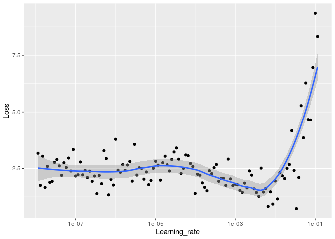
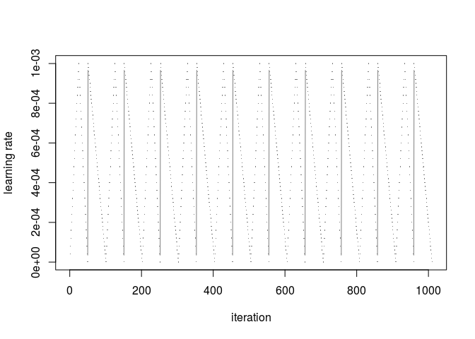

An R Markdown document converted from
“resnet50-lr-finder-and-cyclic-lr-with-r.ipynb”
================

# Keras with R

Long ago, I have learned the basics of deep learning with keras. I got
more used to Fast.ai since then.

But I am a R practitioner and I want to know a framework that I can use
with R. Also, Keras is sometimes required explicity in some job
offers/projects, or for academic research. So in this kernel, I relearn
it with the book *Deep Learning with R*. For the moment my aim is to
have something that work from A to Z, and iterate over it.

Also, I publish this kernel mostly because I realized that I **can’t use
GPU on R kernel**, with Keras. [Issue
here](https://www.kaggle.com/product-feedback/142790#804580).

## To do list :

  - bigger images
  - load best model after training \(\checkmark\)
  - lr finder \(\checkmark\)
  - add data augmentation \(\checkmark\)
  - plot the data augmentation \(\checkmark\)
  - implement one cycle policy ? \(\checkmark\)
  - visualization of what the convnets learn
  - fine
    tuning

<!-- end list -->

``` r
library(tidyverse)
```

    ## ── Attaching packages ─────────────────────────────────────────────────────────────────────────────────────────────────────── tidyverse 1.3.0 ──

    ## ✓ ggplot2 3.3.0     ✓ purrr   0.3.4
    ## ✓ tibble  3.0.0     ✓ dplyr   0.8.5
    ## ✓ tidyr   1.0.2     ✓ stringr 1.4.0
    ## ✓ readr   1.3.1     ✓ forcats 0.5.0

    ## ── Conflicts ────────────────────────────────────────────────────────────────────────────────────────────────────────── tidyverse_conflicts() ──
    ## x dplyr::filter() masks stats::filter()
    ## x dplyr::lag()    masks stats::lag()

``` r
library(keras)
library(tensorflow)
library(reticulate)
```

``` r
use_python("/usr/bin/python3.5", required = TRUE)
tf <- tensorflow::tf
sess <- tf$Session()
```

## Data augmentation and train generator

``` r
labels<-read_csv('plant-pathology-2020-fgvc7/train.csv')
```

    ## Parsed with column specification:
    ## cols(
    ##   image_id = col_character(),
    ##   healthy = col_double(),
    ##   multiple_diseases = col_double(),
    ##   rust = col_double(),
    ##   scab = col_double()
    ## )

``` r
head(labels)
```

    ## # A tibble: 6 x 5
    ##   image_id healthy multiple_diseases  rust  scab
    ##   <chr>      <dbl>             <dbl> <dbl> <dbl>
    ## 1 Train_0        0                 0     0     1
    ## 2 Train_1        0                 1     0     0
    ## 3 Train_2        1                 0     0     0
    ## 4 Train_3        0                 0     1     0
    ## 5 Train_4        1                 0     0     0
    ## 6 Train_5        1                 0     0     0

``` r
labels$image_id <- paste0(labels$image_id, ".jpg")
```

``` r
head(labels)
```

    ## # A tibble: 6 x 5
    ##   image_id    healthy multiple_diseases  rust  scab
    ##   <chr>         <dbl>             <dbl> <dbl> <dbl>
    ## 1 Train_0.jpg       0                 0     0     1
    ## 2 Train_1.jpg       0                 1     0     0
    ## 3 Train_2.jpg       1                 0     0     0
    ## 4 Train_3.jpg       0                 0     1     0
    ## 5 Train_4.jpg       1                 0     0     0
    ## 6 Train_5.jpg       1                 0     0     0

``` r
set.seed(6)
```

``` r
labels <- labels  %>% mutate(id = row_number())#Check IDs

train_labels <- labels  %>% sample_frac(.90)#Create test set
val_labels <- anti_join(labels, train_labels, by = 'id')
train_labels$id<-NULL
val_labels$id<-NULL
```

``` r
head(train_labels)
```

    ## # A tibble: 6 x 5
    ##   image_id       healthy multiple_diseases  rust  scab
    ##   <chr>            <dbl>             <dbl> <dbl> <dbl>
    ## 1 Train_820.jpg        0                 0     0     1
    ## 2 Train_9.jpg          1                 0     0     0
    ## 3 Train_940.jpg        0                 0     1     0
    ## 4 Train_333.jpg        0                 0     1     0
    ## 5 Train_1719.jpg       0                 0     0     1
    ## 6 Train_611.jpg        0                 0     1     0

``` r
head(val_labels)
```

    ## # A tibble: 6 x 5
    ##   image_id     healthy multiple_diseases  rust  scab
    ##   <chr>          <dbl>             <dbl> <dbl> <dbl>
    ## 1 Train_2.jpg        1                 0     0     0
    ## 2 Train_19.jpg       0                 0     0     1
    ## 3 Train_22.jpg       0                 0     0     1
    ## 4 Train_31.jpg       0                 0     1     0
    ## 5 Train_33.jpg       1                 0     0     0
    ## 6 Train_38.jpg       0                 0     1     0

``` r
summary(train_labels)
```

    ##    image_id            healthy       multiple_diseases      rust       
    ##  Length:1639        Min.   :0.0000   Min.   :0.00000   Min.   :0.0000  
    ##  Class :character   1st Qu.:0.0000   1st Qu.:0.00000   1st Qu.:0.0000  
    ##  Mode  :character   Median :0.0000   Median :0.00000   Median :0.0000  
    ##                     Mean   :0.2794   Mean   :0.05003   Mean   :0.3411  
    ##                     3rd Qu.:1.0000   3rd Qu.:0.00000   3rd Qu.:1.0000  
    ##                     Max.   :1.0000   Max.   :1.00000   Max.   :1.0000  
    ##       scab       
    ##  Min.   :0.0000  
    ##  1st Qu.:0.0000  
    ##  Median :0.0000  
    ##  Mean   :0.3295  
    ##  3rd Qu.:1.0000  
    ##  Max.   :1.0000

``` r
summary(val_labels)
```

    ##    image_id            healthy       multiple_diseases      rust       
    ##  Length:182         Min.   :0.0000   Min.   :0.00000   Min.   :0.0000  
    ##  Class :character   1st Qu.:0.0000   1st Qu.:0.00000   1st Qu.:0.0000  
    ##  Mode  :character   Median :0.0000   Median :0.00000   Median :0.0000  
    ##                     Mean   :0.3187   Mean   :0.04945   Mean   :0.3462  
    ##                     3rd Qu.:1.0000   3rd Qu.:0.00000   3rd Qu.:1.0000  
    ##                     Max.   :1.0000   Max.   :1.00000   Max.   :1.0000  
    ##       scab       
    ##  Min.   :0.0000  
    ##  1st Qu.:0.0000  
    ##  Median :0.0000  
    ##  Mean   :0.2857  
    ##  3rd Qu.:1.0000  
    ##  Max.   :1.0000

``` r
image_path<-'plant-pathology-2020-fgvc7/images/'
```

``` r
#reticulate::virtualenv_install(packages="pandas") 
```

``` r
keras::use_implementation("keras")
keras::use_backend("tensorflow")
```

``` r
reticulate::py_config()
```

    ## python:         /usr/bin/python3.5
    ## libpython:      /usr/lib/python3.5/config-3.5m-x86_64-linux-gnu/libpython3.5m.so
    ## pythonhome:     //usr://usr
    ## version:        3.5.2 (default, Apr 16 2020, 17:47:17)  [GCC 5.4.0 20160609]
    ## numpy:          /home/proprietaire/.local/lib/python3.5/site-packages/numpy
    ## numpy_version:  1.18.3
    ## tensorflow:     /home/proprietaire/.local/lib/python3.5/site-packages/tensorflow
    ## 
    ## NOTE: Python version was forced by use_python function

``` r
#data augmentation
datagen <- image_data_generator(
  rotation_range = 40,
  width_shift_range = 0.2,
  height_shift_range = 0.2,
  shear_range = 0.2,
  zoom_range = 0.2,
  horizontal_flip = TRUE,
  fill_mode = "nearest"
)
```

Plotting to see if it works :

``` r
img_path<-"plant-pathology-2020-fgvc7/images/Train_1000.jpg"

img <- image_load(img_path, target_size = c(224, 224))
img_array <- image_to_array(img)
img_array <- array_reshape(img_array, c(1, 224, 224, 3))
img_array<-img_array/255
# Generated that will flow augmented images
augmentation_generator <- flow_images_from_data(
  img_array, 
  generator = datagen, 
  batch_size = 1 
)
op <- par(mfrow = c(2, 2), pty = "s", mar = c(1, 0, 1, 0))
for (i in 1:4) {
  batch <- generator_next(augmentation_generator)
  plot(as.raster(batch[1,,,]))
}
```

<!-- -->

``` r
par(op)
```

``` r
train_generator <- flow_images_from_dataframe(dataframe = train_labels, 
                                              directory = image_path,
                                              generator = datagen,
                                              class_mode = "other",
                                              x_col = "image_id",
                                              y_col = c("healthy", "multiple_diseases", "rust", "scab"),
                                              target_size = c(224, 224),
                                              batch_size=32)
```

``` r
validation_generator <- flow_images_from_dataframe(dataframe = val_labels, 
                                              directory = image_path,
                                              class_mode = "other",
                                              x_col = "image_id",
                                              y_col = c("healthy", "multiple_diseases", "rust", "scab"),
                                              target_size = c(224, 224),
                                              batch_size=32)
```

``` r
train_generator
```

    ## <keras_preprocessing.image.dataframe_iterator.DataFrameIterator>

``` r
batch<-generator_next(train_generator)
str(batch)
```

    ## List of 2
    ##  $ : num [1:32, 1:224, 1:224, 1:3] 90.1 73.1 130.7 81.5 57.9 ...
    ##  $ : num [1:32, 1:4] 0 0 0 0 0 1 0 1 1 0 ...

# Import pre-trained model

How to choose the parameters ? c(224, 224, 3) is the default of Resnet,
came from the default if include\_top is set to
true.

``` r
conv_base <- application_resnet50(weights = 'imagenet', include_top = FALSE, input_shape = c(224, 224, 3))
```

``` r
conv_base
```

    ## Model
    ## ________________________________________________________________________________
    ## Layer (type)              Output Shape      Param #  Connected to               
    ## ================================================================================
    ## input_1 (InputLayer)      (None, 224, 224,  0                                   
    ## ________________________________________________________________________________
    ## conv1_pad (ZeroPadding2D) (None, 230, 230,  0        input_1[0][0]              
    ## ________________________________________________________________________________
    ## conv1 (Conv2D)            (None, 112, 112,  9472     conv1_pad[0][0]            
    ## ________________________________________________________________________________
    ## bn_conv1 (BatchNormalizat (None, 112, 112,  256      conv1[0][0]                
    ## ________________________________________________________________________________
    ## activation_1 (Activation) (None, 112, 112,  0        bn_conv1[0][0]             
    ## ________________________________________________________________________________
    ## pool1_pad (ZeroPadding2D) (None, 114, 114,  0        activation_1[0][0]         
    ## ________________________________________________________________________________
    ## max_pooling2d_1 (MaxPooli (None, 56, 56, 64 0        pool1_pad[0][0]            
    ## ________________________________________________________________________________
    ## res2a_branch2a (Conv2D)   (None, 56, 56, 64 4160     max_pooling2d_1[0][0]      
    ## ________________________________________________________________________________
    ## bn2a_branch2a (BatchNorma (None, 56, 56, 64 256      res2a_branch2a[0][0]       
    ## ________________________________________________________________________________
    ## activation_2 (Activation) (None, 56, 56, 64 0        bn2a_branch2a[0][0]        
    ## ________________________________________________________________________________
    ## res2a_branch2b (Conv2D)   (None, 56, 56, 64 36928    activation_2[0][0]         
    ## ________________________________________________________________________________
    ## bn2a_branch2b (BatchNorma (None, 56, 56, 64 256      res2a_branch2b[0][0]       
    ## ________________________________________________________________________________
    ## activation_3 (Activation) (None, 56, 56, 64 0        bn2a_branch2b[0][0]        
    ## ________________________________________________________________________________
    ## res2a_branch2c (Conv2D)   (None, 56, 56, 25 16640    activation_3[0][0]         
    ## ________________________________________________________________________________
    ## res2a_branch1 (Conv2D)    (None, 56, 56, 25 16640    max_pooling2d_1[0][0]      
    ## ________________________________________________________________________________
    ## bn2a_branch2c (BatchNorma (None, 56, 56, 25 1024     res2a_branch2c[0][0]       
    ## ________________________________________________________________________________
    ## bn2a_branch1 (BatchNormal (None, 56, 56, 25 1024     res2a_branch1[0][0]        
    ## ________________________________________________________________________________
    ## add_1 (Add)               (None, 56, 56, 25 0        bn2a_branch2c[0][0]        
    ##                                                      bn2a_branch1[0][0]         
    ## ________________________________________________________________________________
    ## activation_4 (Activation) (None, 56, 56, 25 0        add_1[0][0]                
    ## ________________________________________________________________________________
    ## res2b_branch2a (Conv2D)   (None, 56, 56, 64 16448    activation_4[0][0]         
    ## ________________________________________________________________________________
    ## bn2b_branch2a (BatchNorma (None, 56, 56, 64 256      res2b_branch2a[0][0]       
    ## ________________________________________________________________________________
    ## activation_5 (Activation) (None, 56, 56, 64 0        bn2b_branch2a[0][0]        
    ## ________________________________________________________________________________
    ## res2b_branch2b (Conv2D)   (None, 56, 56, 64 36928    activation_5[0][0]         
    ## ________________________________________________________________________________
    ## bn2b_branch2b (BatchNorma (None, 56, 56, 64 256      res2b_branch2b[0][0]       
    ## ________________________________________________________________________________
    ## activation_6 (Activation) (None, 56, 56, 64 0        bn2b_branch2b[0][0]        
    ## ________________________________________________________________________________
    ## res2b_branch2c (Conv2D)   (None, 56, 56, 25 16640    activation_6[0][0]         
    ## ________________________________________________________________________________
    ## bn2b_branch2c (BatchNorma (None, 56, 56, 25 1024     res2b_branch2c[0][0]       
    ## ________________________________________________________________________________
    ## add_2 (Add)               (None, 56, 56, 25 0        bn2b_branch2c[0][0]        
    ##                                                      activation_4[0][0]         
    ## ________________________________________________________________________________
    ## activation_7 (Activation) (None, 56, 56, 25 0        add_2[0][0]                
    ## ________________________________________________________________________________
    ## res2c_branch2a (Conv2D)   (None, 56, 56, 64 16448    activation_7[0][0]         
    ## ________________________________________________________________________________
    ## bn2c_branch2a (BatchNorma (None, 56, 56, 64 256      res2c_branch2a[0][0]       
    ## ________________________________________________________________________________
    ## activation_8 (Activation) (None, 56, 56, 64 0        bn2c_branch2a[0][0]        
    ## ________________________________________________________________________________
    ## res2c_branch2b (Conv2D)   (None, 56, 56, 64 36928    activation_8[0][0]         
    ## ________________________________________________________________________________
    ## bn2c_branch2b (BatchNorma (None, 56, 56, 64 256      res2c_branch2b[0][0]       
    ## ________________________________________________________________________________
    ## activation_9 (Activation) (None, 56, 56, 64 0        bn2c_branch2b[0][0]        
    ## ________________________________________________________________________________
    ## res2c_branch2c (Conv2D)   (None, 56, 56, 25 16640    activation_9[0][0]         
    ## ________________________________________________________________________________
    ## bn2c_branch2c (BatchNorma (None, 56, 56, 25 1024     res2c_branch2c[0][0]       
    ## ________________________________________________________________________________
    ## add_3 (Add)               (None, 56, 56, 25 0        bn2c_branch2c[0][0]        
    ##                                                      activation_7[0][0]         
    ## ________________________________________________________________________________
    ## activation_10 (Activation (None, 56, 56, 25 0        add_3[0][0]                
    ## ________________________________________________________________________________
    ## res3a_branch2a (Conv2D)   (None, 28, 28, 12 32896    activation_10[0][0]        
    ## ________________________________________________________________________________
    ## bn3a_branch2a (BatchNorma (None, 28, 28, 12 512      res3a_branch2a[0][0]       
    ## ________________________________________________________________________________
    ## activation_11 (Activation (None, 28, 28, 12 0        bn3a_branch2a[0][0]        
    ## ________________________________________________________________________________
    ## res3a_branch2b (Conv2D)   (None, 28, 28, 12 147584   activation_11[0][0]        
    ## ________________________________________________________________________________
    ## bn3a_branch2b (BatchNorma (None, 28, 28, 12 512      res3a_branch2b[0][0]       
    ## ________________________________________________________________________________
    ## activation_12 (Activation (None, 28, 28, 12 0        bn3a_branch2b[0][0]        
    ## ________________________________________________________________________________
    ## res3a_branch2c (Conv2D)   (None, 28, 28, 51 66048    activation_12[0][0]        
    ## ________________________________________________________________________________
    ## res3a_branch1 (Conv2D)    (None, 28, 28, 51 131584   activation_10[0][0]        
    ## ________________________________________________________________________________
    ## bn3a_branch2c (BatchNorma (None, 28, 28, 51 2048     res3a_branch2c[0][0]       
    ## ________________________________________________________________________________
    ## bn3a_branch1 (BatchNormal (None, 28, 28, 51 2048     res3a_branch1[0][0]        
    ## ________________________________________________________________________________
    ## add_4 (Add)               (None, 28, 28, 51 0        bn3a_branch2c[0][0]        
    ##                                                      bn3a_branch1[0][0]         
    ## ________________________________________________________________________________
    ## activation_13 (Activation (None, 28, 28, 51 0        add_4[0][0]                
    ## ________________________________________________________________________________
    ## res3b_branch2a (Conv2D)   (None, 28, 28, 12 65664    activation_13[0][0]        
    ## ________________________________________________________________________________
    ## bn3b_branch2a (BatchNorma (None, 28, 28, 12 512      res3b_branch2a[0][0]       
    ## ________________________________________________________________________________
    ## activation_14 (Activation (None, 28, 28, 12 0        bn3b_branch2a[0][0]        
    ## ________________________________________________________________________________
    ## res3b_branch2b (Conv2D)   (None, 28, 28, 12 147584   activation_14[0][0]        
    ## ________________________________________________________________________________
    ## bn3b_branch2b (BatchNorma (None, 28, 28, 12 512      res3b_branch2b[0][0]       
    ## ________________________________________________________________________________
    ## activation_15 (Activation (None, 28, 28, 12 0        bn3b_branch2b[0][0]        
    ## ________________________________________________________________________________
    ## res3b_branch2c (Conv2D)   (None, 28, 28, 51 66048    activation_15[0][0]        
    ## ________________________________________________________________________________
    ## bn3b_branch2c (BatchNorma (None, 28, 28, 51 2048     res3b_branch2c[0][0]       
    ## ________________________________________________________________________________
    ## add_5 (Add)               (None, 28, 28, 51 0        bn3b_branch2c[0][0]        
    ##                                                      activation_13[0][0]        
    ## ________________________________________________________________________________
    ## activation_16 (Activation (None, 28, 28, 51 0        add_5[0][0]                
    ## ________________________________________________________________________________
    ## res3c_branch2a (Conv2D)   (None, 28, 28, 12 65664    activation_16[0][0]        
    ## ________________________________________________________________________________
    ## bn3c_branch2a (BatchNorma (None, 28, 28, 12 512      res3c_branch2a[0][0]       
    ## ________________________________________________________________________________
    ## activation_17 (Activation (None, 28, 28, 12 0        bn3c_branch2a[0][0]        
    ## ________________________________________________________________________________
    ## res3c_branch2b (Conv2D)   (None, 28, 28, 12 147584   activation_17[0][0]        
    ## ________________________________________________________________________________
    ## bn3c_branch2b (BatchNorma (None, 28, 28, 12 512      res3c_branch2b[0][0]       
    ## ________________________________________________________________________________
    ## activation_18 (Activation (None, 28, 28, 12 0        bn3c_branch2b[0][0]        
    ## ________________________________________________________________________________
    ## res3c_branch2c (Conv2D)   (None, 28, 28, 51 66048    activation_18[0][0]        
    ## ________________________________________________________________________________
    ## bn3c_branch2c (BatchNorma (None, 28, 28, 51 2048     res3c_branch2c[0][0]       
    ## ________________________________________________________________________________
    ## add_6 (Add)               (None, 28, 28, 51 0        bn3c_branch2c[0][0]        
    ##                                                      activation_16[0][0]        
    ## ________________________________________________________________________________
    ## activation_19 (Activation (None, 28, 28, 51 0        add_6[0][0]                
    ## ________________________________________________________________________________
    ## res3d_branch2a (Conv2D)   (None, 28, 28, 12 65664    activation_19[0][0]        
    ## ________________________________________________________________________________
    ## bn3d_branch2a (BatchNorma (None, 28, 28, 12 512      res3d_branch2a[0][0]       
    ## ________________________________________________________________________________
    ## activation_20 (Activation (None, 28, 28, 12 0        bn3d_branch2a[0][0]        
    ## ________________________________________________________________________________
    ## res3d_branch2b (Conv2D)   (None, 28, 28, 12 147584   activation_20[0][0]        
    ## ________________________________________________________________________________
    ## bn3d_branch2b (BatchNorma (None, 28, 28, 12 512      res3d_branch2b[0][0]       
    ## ________________________________________________________________________________
    ## activation_21 (Activation (None, 28, 28, 12 0        bn3d_branch2b[0][0]        
    ## ________________________________________________________________________________
    ## res3d_branch2c (Conv2D)   (None, 28, 28, 51 66048    activation_21[0][0]        
    ## ________________________________________________________________________________
    ## bn3d_branch2c (BatchNorma (None, 28, 28, 51 2048     res3d_branch2c[0][0]       
    ## ________________________________________________________________________________
    ## add_7 (Add)               (None, 28, 28, 51 0        bn3d_branch2c[0][0]        
    ##                                                      activation_19[0][0]        
    ## ________________________________________________________________________________
    ## activation_22 (Activation (None, 28, 28, 51 0        add_7[0][0]                
    ## ________________________________________________________________________________
    ## res4a_branch2a (Conv2D)   (None, 14, 14, 25 131328   activation_22[0][0]        
    ## ________________________________________________________________________________
    ## bn4a_branch2a (BatchNorma (None, 14, 14, 25 1024     res4a_branch2a[0][0]       
    ## ________________________________________________________________________________
    ## activation_23 (Activation (None, 14, 14, 25 0        bn4a_branch2a[0][0]        
    ## ________________________________________________________________________________
    ## res4a_branch2b (Conv2D)   (None, 14, 14, 25 590080   activation_23[0][0]        
    ## ________________________________________________________________________________
    ## bn4a_branch2b (BatchNorma (None, 14, 14, 25 1024     res4a_branch2b[0][0]       
    ## ________________________________________________________________________________
    ## activation_24 (Activation (None, 14, 14, 25 0        bn4a_branch2b[0][0]        
    ## ________________________________________________________________________________
    ## res4a_branch2c (Conv2D)   (None, 14, 14, 10 263168   activation_24[0][0]        
    ## ________________________________________________________________________________
    ## res4a_branch1 (Conv2D)    (None, 14, 14, 10 525312   activation_22[0][0]        
    ## ________________________________________________________________________________
    ## bn4a_branch2c (BatchNorma (None, 14, 14, 10 4096     res4a_branch2c[0][0]       
    ## ________________________________________________________________________________
    ## bn4a_branch1 (BatchNormal (None, 14, 14, 10 4096     res4a_branch1[0][0]        
    ## ________________________________________________________________________________
    ## add_8 (Add)               (None, 14, 14, 10 0        bn4a_branch2c[0][0]        
    ##                                                      bn4a_branch1[0][0]         
    ## ________________________________________________________________________________
    ## activation_25 (Activation (None, 14, 14, 10 0        add_8[0][0]                
    ## ________________________________________________________________________________
    ## res4b_branch2a (Conv2D)   (None, 14, 14, 25 262400   activation_25[0][0]        
    ## ________________________________________________________________________________
    ## bn4b_branch2a (BatchNorma (None, 14, 14, 25 1024     res4b_branch2a[0][0]       
    ## ________________________________________________________________________________
    ## activation_26 (Activation (None, 14, 14, 25 0        bn4b_branch2a[0][0]        
    ## ________________________________________________________________________________
    ## res4b_branch2b (Conv2D)   (None, 14, 14, 25 590080   activation_26[0][0]        
    ## ________________________________________________________________________________
    ## bn4b_branch2b (BatchNorma (None, 14, 14, 25 1024     res4b_branch2b[0][0]       
    ## ________________________________________________________________________________
    ## activation_27 (Activation (None, 14, 14, 25 0        bn4b_branch2b[0][0]        
    ## ________________________________________________________________________________
    ## res4b_branch2c (Conv2D)   (None, 14, 14, 10 263168   activation_27[0][0]        
    ## ________________________________________________________________________________
    ## bn4b_branch2c (BatchNorma (None, 14, 14, 10 4096     res4b_branch2c[0][0]       
    ## ________________________________________________________________________________
    ## add_9 (Add)               (None, 14, 14, 10 0        bn4b_branch2c[0][0]        
    ##                                                      activation_25[0][0]        
    ## ________________________________________________________________________________
    ## activation_28 (Activation (None, 14, 14, 10 0        add_9[0][0]                
    ## ________________________________________________________________________________
    ## res4c_branch2a (Conv2D)   (None, 14, 14, 25 262400   activation_28[0][0]        
    ## ________________________________________________________________________________
    ## bn4c_branch2a (BatchNorma (None, 14, 14, 25 1024     res4c_branch2a[0][0]       
    ## ________________________________________________________________________________
    ## activation_29 (Activation (None, 14, 14, 25 0        bn4c_branch2a[0][0]        
    ## ________________________________________________________________________________
    ## res4c_branch2b (Conv2D)   (None, 14, 14, 25 590080   activation_29[0][0]        
    ## ________________________________________________________________________________
    ## bn4c_branch2b (BatchNorma (None, 14, 14, 25 1024     res4c_branch2b[0][0]       
    ## ________________________________________________________________________________
    ## activation_30 (Activation (None, 14, 14, 25 0        bn4c_branch2b[0][0]        
    ## ________________________________________________________________________________
    ## res4c_branch2c (Conv2D)   (None, 14, 14, 10 263168   activation_30[0][0]        
    ## ________________________________________________________________________________
    ## bn4c_branch2c (BatchNorma (None, 14, 14, 10 4096     res4c_branch2c[0][0]       
    ## ________________________________________________________________________________
    ## add_10 (Add)              (None, 14, 14, 10 0        bn4c_branch2c[0][0]        
    ##                                                      activation_28[0][0]        
    ## ________________________________________________________________________________
    ## activation_31 (Activation (None, 14, 14, 10 0        add_10[0][0]               
    ## ________________________________________________________________________________
    ## res4d_branch2a (Conv2D)   (None, 14, 14, 25 262400   activation_31[0][0]        
    ## ________________________________________________________________________________
    ## bn4d_branch2a (BatchNorma (None, 14, 14, 25 1024     res4d_branch2a[0][0]       
    ## ________________________________________________________________________________
    ## activation_32 (Activation (None, 14, 14, 25 0        bn4d_branch2a[0][0]        
    ## ________________________________________________________________________________
    ## res4d_branch2b (Conv2D)   (None, 14, 14, 25 590080   activation_32[0][0]        
    ## ________________________________________________________________________________
    ## bn4d_branch2b (BatchNorma (None, 14, 14, 25 1024     res4d_branch2b[0][0]       
    ## ________________________________________________________________________________
    ## activation_33 (Activation (None, 14, 14, 25 0        bn4d_branch2b[0][0]        
    ## ________________________________________________________________________________
    ## res4d_branch2c (Conv2D)   (None, 14, 14, 10 263168   activation_33[0][0]        
    ## ________________________________________________________________________________
    ## bn4d_branch2c (BatchNorma (None, 14, 14, 10 4096     res4d_branch2c[0][0]       
    ## ________________________________________________________________________________
    ## add_11 (Add)              (None, 14, 14, 10 0        bn4d_branch2c[0][0]        
    ##                                                      activation_31[0][0]        
    ## ________________________________________________________________________________
    ## activation_34 (Activation (None, 14, 14, 10 0        add_11[0][0]               
    ## ________________________________________________________________________________
    ## res4e_branch2a (Conv2D)   (None, 14, 14, 25 262400   activation_34[0][0]        
    ## ________________________________________________________________________________
    ## bn4e_branch2a (BatchNorma (None, 14, 14, 25 1024     res4e_branch2a[0][0]       
    ## ________________________________________________________________________________
    ## activation_35 (Activation (None, 14, 14, 25 0        bn4e_branch2a[0][0]        
    ## ________________________________________________________________________________
    ## res4e_branch2b (Conv2D)   (None, 14, 14, 25 590080   activation_35[0][0]        
    ## ________________________________________________________________________________
    ## bn4e_branch2b (BatchNorma (None, 14, 14, 25 1024     res4e_branch2b[0][0]       
    ## ________________________________________________________________________________
    ## activation_36 (Activation (None, 14, 14, 25 0        bn4e_branch2b[0][0]        
    ## ________________________________________________________________________________
    ## res4e_branch2c (Conv2D)   (None, 14, 14, 10 263168   activation_36[0][0]        
    ## ________________________________________________________________________________
    ## bn4e_branch2c (BatchNorma (None, 14, 14, 10 4096     res4e_branch2c[0][0]       
    ## ________________________________________________________________________________
    ## add_12 (Add)              (None, 14, 14, 10 0        bn4e_branch2c[0][0]        
    ##                                                      activation_34[0][0]        
    ## ________________________________________________________________________________
    ## activation_37 (Activation (None, 14, 14, 10 0        add_12[0][0]               
    ## ________________________________________________________________________________
    ## res4f_branch2a (Conv2D)   (None, 14, 14, 25 262400   activation_37[0][0]        
    ## ________________________________________________________________________________
    ## bn4f_branch2a (BatchNorma (None, 14, 14, 25 1024     res4f_branch2a[0][0]       
    ## ________________________________________________________________________________
    ## activation_38 (Activation (None, 14, 14, 25 0        bn4f_branch2a[0][0]        
    ## ________________________________________________________________________________
    ## res4f_branch2b (Conv2D)   (None, 14, 14, 25 590080   activation_38[0][0]        
    ## ________________________________________________________________________________
    ## bn4f_branch2b (BatchNorma (None, 14, 14, 25 1024     res4f_branch2b[0][0]       
    ## ________________________________________________________________________________
    ## activation_39 (Activation (None, 14, 14, 25 0        bn4f_branch2b[0][0]        
    ## ________________________________________________________________________________
    ## res4f_branch2c (Conv2D)   (None, 14, 14, 10 263168   activation_39[0][0]        
    ## ________________________________________________________________________________
    ## bn4f_branch2c (BatchNorma (None, 14, 14, 10 4096     res4f_branch2c[0][0]       
    ## ________________________________________________________________________________
    ## add_13 (Add)              (None, 14, 14, 10 0        bn4f_branch2c[0][0]        
    ##                                                      activation_37[0][0]        
    ## ________________________________________________________________________________
    ## activation_40 (Activation (None, 14, 14, 10 0        add_13[0][0]               
    ## ________________________________________________________________________________
    ## res5a_branch2a (Conv2D)   (None, 7, 7, 512) 524800   activation_40[0][0]        
    ## ________________________________________________________________________________
    ## bn5a_branch2a (BatchNorma (None, 7, 7, 512) 2048     res5a_branch2a[0][0]       
    ## ________________________________________________________________________________
    ## activation_41 (Activation (None, 7, 7, 512) 0        bn5a_branch2a[0][0]        
    ## ________________________________________________________________________________
    ## res5a_branch2b (Conv2D)   (None, 7, 7, 512) 2359808  activation_41[0][0]        
    ## ________________________________________________________________________________
    ## bn5a_branch2b (BatchNorma (None, 7, 7, 512) 2048     res5a_branch2b[0][0]       
    ## ________________________________________________________________________________
    ## activation_42 (Activation (None, 7, 7, 512) 0        bn5a_branch2b[0][0]        
    ## ________________________________________________________________________________
    ## res5a_branch2c (Conv2D)   (None, 7, 7, 2048 1050624  activation_42[0][0]        
    ## ________________________________________________________________________________
    ## res5a_branch1 (Conv2D)    (None, 7, 7, 2048 2099200  activation_40[0][0]        
    ## ________________________________________________________________________________
    ## bn5a_branch2c (BatchNorma (None, 7, 7, 2048 8192     res5a_branch2c[0][0]       
    ## ________________________________________________________________________________
    ## bn5a_branch1 (BatchNormal (None, 7, 7, 2048 8192     res5a_branch1[0][0]        
    ## ________________________________________________________________________________
    ## add_14 (Add)              (None, 7, 7, 2048 0        bn5a_branch2c[0][0]        
    ##                                                      bn5a_branch1[0][0]         
    ## ________________________________________________________________________________
    ## activation_43 (Activation (None, 7, 7, 2048 0        add_14[0][0]               
    ## ________________________________________________________________________________
    ## res5b_branch2a (Conv2D)   (None, 7, 7, 512) 1049088  activation_43[0][0]        
    ## ________________________________________________________________________________
    ## bn5b_branch2a (BatchNorma (None, 7, 7, 512) 2048     res5b_branch2a[0][0]       
    ## ________________________________________________________________________________
    ## activation_44 (Activation (None, 7, 7, 512) 0        bn5b_branch2a[0][0]        
    ## ________________________________________________________________________________
    ## res5b_branch2b (Conv2D)   (None, 7, 7, 512) 2359808  activation_44[0][0]        
    ## ________________________________________________________________________________
    ## bn5b_branch2b (BatchNorma (None, 7, 7, 512) 2048     res5b_branch2b[0][0]       
    ## ________________________________________________________________________________
    ## activation_45 (Activation (None, 7, 7, 512) 0        bn5b_branch2b[0][0]        
    ## ________________________________________________________________________________
    ## res5b_branch2c (Conv2D)   (None, 7, 7, 2048 1050624  activation_45[0][0]        
    ## ________________________________________________________________________________
    ## bn5b_branch2c (BatchNorma (None, 7, 7, 2048 8192     res5b_branch2c[0][0]       
    ## ________________________________________________________________________________
    ## add_15 (Add)              (None, 7, 7, 2048 0        bn5b_branch2c[0][0]        
    ##                                                      activation_43[0][0]        
    ## ________________________________________________________________________________
    ## activation_46 (Activation (None, 7, 7, 2048 0        add_15[0][0]               
    ## ________________________________________________________________________________
    ## res5c_branch2a (Conv2D)   (None, 7, 7, 512) 1049088  activation_46[0][0]        
    ## ________________________________________________________________________________
    ## bn5c_branch2a (BatchNorma (None, 7, 7, 512) 2048     res5c_branch2a[0][0]       
    ## ________________________________________________________________________________
    ## activation_47 (Activation (None, 7, 7, 512) 0        bn5c_branch2a[0][0]        
    ## ________________________________________________________________________________
    ## res5c_branch2b (Conv2D)   (None, 7, 7, 512) 2359808  activation_47[0][0]        
    ## ________________________________________________________________________________
    ## bn5c_branch2b (BatchNorma (None, 7, 7, 512) 2048     res5c_branch2b[0][0]       
    ## ________________________________________________________________________________
    ## activation_48 (Activation (None, 7, 7, 512) 0        bn5c_branch2b[0][0]        
    ## ________________________________________________________________________________
    ## res5c_branch2c (Conv2D)   (None, 7, 7, 2048 1050624  activation_48[0][0]        
    ## ________________________________________________________________________________
    ## bn5c_branch2c (BatchNorma (None, 7, 7, 2048 8192     res5c_branch2c[0][0]       
    ## ________________________________________________________________________________
    ## add_16 (Add)              (None, 7, 7, 2048 0        bn5c_branch2c[0][0]        
    ##                                                      activation_46[0][0]        
    ## ________________________________________________________________________________
    ## activation_49 (Activation (None, 7, 7, 2048 0        add_16[0][0]               
    ## ================================================================================
    ## Total params: 23,587,712
    ## Trainable params: 23,534,592
    ## Non-trainable params: 53,120
    ## ________________________________________________________________________________

``` r
freeze_weights(conv_base)
```

How to decide to what to add to the conv\_base of a Resnet-50 ? Running
the following allow to look what the Resnet looks like normally
:

``` r
#look <- application_resnet50(weights = 'imagenet', include_top = TRUE, input_shape = c(224, 224, 3))
#look

#________________________________________________________________________________
#conv5_block3_out (Activat (None, 7, 7, 2048 0        conv5_block3_add[0][0]     
#________________________________________________________________________________
#avg_pool (GlobalAveragePo (None, 2048)      0        conv5_block3_out[0][0]     
#________________________________________________________________________________
#probs (Dense)             (None, 1000)      2049000  avg_pool[0][0]             
#================================================================================
```

But it gave quite poor results. Actually I have tried to look in other
kernels, without finding clear consensus. Finally I will add some layer
in a similar way on [how it is done in
fast\_ai](https://docs.fast.ai/vision.learner.html#create_head). Since
there is a “funny” pooling operation, I will had a max pooling, because
we are most interresting to know if there is a rust or scab, that
something on “average”. Or maybe I am wronng ?

``` r
model <- keras_model_sequential() %>% 
        conv_base %>% 
        layer_global_max_pooling_2d() %>% 
        #layer_flatten() %>%
        layer_batch_normalization() %>%
        layer_dropout(rate=0.5) %>%
        layer_dense(units=4, activation="softmax")
```

``` r
model
```

    ## Model
    ## ________________________________________________________________________________
    ## Layer (type)                        Output Shape                    Param #     
    ## ================================================================================
    ## resnet50 (Model)                    (None, 7, 7, 2048)              23587712    
    ## ________________________________________________________________________________
    ## global_max_pooling2d_1 (GlobalMaxPo (None, 2048)                    0           
    ## ________________________________________________________________________________
    ## batch_normalization_1 (BatchNormali (None, 2048)                    8192        
    ## ________________________________________________________________________________
    ## dropout_1 (Dropout)                 (None, 2048)                    0           
    ## ________________________________________________________________________________
    ## dense_1 (Dense)                     (None, 4)                       8196        
    ## ================================================================================
    ## Total params: 23,604,100
    ## Trainable params: 12,292
    ## Non-trainable params: 23,591,808
    ## ________________________________________________________________________________

## Learning rate finder

Keras force you to ask yourself a lot of question, including the good
learning rate to use. I was not really successfull to do so, so I
reimplement a learning rate finder, based on the code of this [excellent
article](http://thecooldata.com/2019/01/learning-rate-finder-with-cifar10-keras-r/),
but with some change for the the maths [of this article about
fast.ai](https://sgugger.github.io/how-do-you-find-a-good-learning-rate.html)
(for the different learning rate explored in the initial phase).

``` r
LogMetrics <- R6::R6Class("LogMetrics",
  inherit = KerasCallback,
  public = list(
    loss = NULL,
    acc = NULL,
    on_batch_end = function(batch, logs=list()) {
      self$loss <- c(self$loss, logs[["loss"]])
      self$acc <- c(self$acc, logs[["acc"]])
    }
))
```

``` r
callback_lr_init <- function(logs){
      iter <<- 0
      lr_hist <<- c()
      iter_hist <<- c()
}
callback_lr_set <- function(batch, logs){
      iter <<- iter + 1
      LR <- l_rate[iter] # if number of iterations > l_rate values, make LR constant to last value
      if(is.na(LR)) LR <- l_rate[length(l_rate)]
      k_set_value(model$optimizer$lr, LR)
}
callback_lr_log <- function(batch, logs){
      lr_hist <<- c(lr_hist, k_get_value(model$optimizer$lr))
      iter_hist <<- c(iter_hist, k_get_value(model$optimizer$iterations))
}
```

``` r
callback_lr <- callback_lambda(on_train_begin=callback_lr_init, on_batch_begin=callback_lr_set)
callback_logger <- callback_lambda(on_batch_end=callback_lr_log)
callback_log_acc_lr <- LogMetrics$new()
```

``` r
lr0<-1e-8
lr_max<-0.01

#n_iteration :
n<-100
q<-(lr_max/lr0)^(1/(n-1))
```

``` r
i<-1:n
l_rate<-lr0*(q^i)
plot(l_rate, type="b", pch=16, cex=0.1, xlab="iteration", ylab="learning rate")
```

<!-- -->

``` r
model %>% compile(
    optimizer=optimizer_rmsprop(lr=lr_max),
    loss="categorical_crossentropy",
    metrics='accuracy'
)
```

``` r
callback_list = list(callback_lr, callback_logger, callback_log_acc_lr)
```

``` r
history <- model %>% fit_generator(
    train_generator,
    steps_per_epoch=n,
    epochs = 1,
    callbacks = callback_list,
    validation_data = validation_generator,
    validation_step=30
)
```

``` r
data <- data.frame("Learning_rate" = lr_hist, "Loss" = callback_log_acc_lr$loss)
head(data)
```

    ##   Learning_rate     Loss
    ## 1  1.149757e-08 2.963216
    ## 2  1.321941e-08 2.605625
    ## 3  1.519911e-08 2.170684
    ## 4  1.747528e-08 2.284032
    ## 5  2.009233e-08 3.198197
    ## 6  2.310130e-08 2.024627

Learning rate vs loss
:

``` r
ggplot(data, aes(x=Learning_rate, y=Loss)) + scale_x_log10() + geom_point() +  geom_smooth(span = 0.5)
```

    ## `geom_smooth()` using method = 'loess' and formula 'y ~ x'

<!-- -->

More centered on the moment when the slope goes down :

``` r
limits<-quantile(data$Loss, probs = c(0.10, 0.90))
ggplot(data, aes(x=Learning_rate, y=Loss)) + scale_x_log10() + 
scale_y_continuous(name="Loss", limits=limits)+ geom_point() +  geom_smooth(span = 0.5)
```

    ## `geom_smooth()` using method = 'loess' and formula 'y ~ x'

    ## Warning: Removed 20 rows containing non-finite values (stat_smooth).

    ## Warning: Removed 20 rows containing missing values (geom_point).

<!-- -->

Based on this graph I would go on a base\_lr=1e-5, and a max lr of 1e-3.

# Training with cyclic lr

``` r
####################
Cyclic_LR <- function(iteration=1:32000, base_lr=1e-5, max_lr=1e-3, step_size=2000, mode='triangular', gamma=1, scale_fn=NULL, scale_mode='cycle'){ # translated from python to R, original at: https://github.com/bckenstler/CLR/blob/master/clr_callback.py # This callback implements a cyclical learning rate policy (CLR). # The method cycles the learning rate between two boundaries with # some constant frequency, as detailed in this paper (https://arxiv.org/abs/1506.01186). # The amplitude of the cycle can be scaled on a per-iteration or per-cycle basis. # This class has three built-in policies, as put forth in the paper. # - "triangular": A basic triangular cycle w/ no amplitude scaling. # - "triangular2": A basic triangular cycle that scales initial amplitude by half each cycle. # - "exp_range": A cycle that scales initial amplitude by gamma**(cycle iterations) at each cycle iteration. # - "sinus": A sinusoidal form cycle # # Example # > clr <- Cyclic_LR(base_lr=0.001, max_lr=0.006, step_size=2000, mode='triangular', num_iterations=20000) # > plot(clr, cex=0.2)
 
      # Class also supports custom scaling functions with function output max value of 1:
      # > clr_fn <- function(x) 1/x # > clr <- Cyclic_LR(base_lr=0.001, max_lr=0.006, step_size=400, # scale_fn=clr_fn, scale_mode='cycle', num_iterations=20000) # > plot(clr, cex=0.2)
 
      # # Arguments
      #   iteration:
      #       if is a number:
      #           id of the iteration where: max iteration = epochs * (samples/batch)
      #       if "iteration" is a vector i.e.: iteration=1:10000:
      #           returns the whole sequence of lr as a vector
      #   base_lr: initial learning rate which is the
      #       lower boundary in the cycle.
      #   max_lr: upper boundary in the cycle. Functionally,
      #       it defines the cycle amplitude (max_lr - base_lr).
      #       The lr at any cycle is the sum of base_lr
      #       and some scaling of the amplitude; therefore 
      #       max_lr may not actually be reached depending on
      #       scaling function.
      #   step_size: number of training iterations per
      #       half cycle. Authors suggest setting step_size
      #       2-8 x training iterations in epoch.
      #   mode: one of {triangular, triangular2, exp_range, sinus}.
      #       Default 'triangular'.
      #       Values correspond to policies detailed above.
      #       If scale_fn is not None, this argument is ignored.
      #   gamma: constant in 'exp_range' scaling function:
      #       gamma**(cycle iterations)
      #   scale_fn: Custom scaling policy defined by a single
      #       argument lambda function, where 
      #       0 <= scale_fn(x) <= 1 for all x >= 0.
      #       mode paramater is ignored 
      #   scale_mode: {'cycle', 'iterations'}.
      #       Defines whether scale_fn is evaluated on 
      #       cycle number or cycle iterations (training
      #       iterations since start of cycle). Default is 'cycle'.
 
      ########
      if(is.null(scale_fn)==TRUE){
            if(mode=='triangular'){scale_fn <- function(x) 1; scale_mode <- 'cycle';}
            if(mode=='triangular2'){scale_fn <- function(x) 1/(2^(x-1)); scale_mode <- 'cycle';}
            if(mode=='exp_range'){scale_fn <- function(x) gamma^(x); scale_mode <- 'iterations';}
            if(mode=='sinus'){scale_fn <- function(x) 0.5*(1+sin(x*pi/2)); scale_mode <- 'cycle';}
      }
      lr <- list()
      if(is.vector(iteration)==TRUE){
            for(iter in iteration){
                  cycle <- floor(1 + (iter / (2*step_size)))
                  x2 <- abs(iter/step_size-2 * cycle+1)
                  if(scale_mode=='cycle') x <- cycle
                  if(scale_mode=='iterations') x <- iter
                  lr[[iter]] <- base_lr + (max_lr-base_lr) * max(0,(1-x2)) * scale_fn(x)
            }
      }
      lr <- do.call("rbind",lr)
      return(as.vector(lr))
}
```

Parameters are similar to v6, just playing around to explore the
possibility. In version 11 the floor parameters is not n but n/2. Based
on the graph of v6, 10 epoch are enought to see if there is overfitting
or not, and if the learning of the network does not fall to early.

``` r
n=40
nb_epochs=10
n_iter<-n*nb_epochs
```

Exp range since triangular lead to a quick overfitting
:

``` r
l_rate <- Cyclic_LR(iteration=1:n_iter, base_lr=1e-5, max_lr=1e-3, step_size=floor(n/2),
                        mode='exp_range', gamma=0.99, scale_fn=NULL, scale_mode='cycle')
```

``` r
plot(l_rate, type="b", pch=16, xlab="iteration", cex=0.2, ylab="learning rate", col="grey50")
```

<!-- -->

Clean model for training :

``` r
model <- keras_model_sequential() %>% 
        conv_base %>% 
        layer_global_max_pooling_2d() %>% 
        layer_batch_normalization() %>%
        layer_dropout(rate=0.5) %>%
        layer_dense(units=4, activation="softmax")
```

``` r
model %>% compile(
    optimizer=optimizer_rmsprop(lr=1e-5),
    loss="categorical_crossentropy",
    metrics='accuracy'
)
```

``` r
callback_list<-list(callback_lr, #callback to update lr
    callback_model_checkpoint(filepath = "raw_model.h5", monitor = "val_acc", save_best_only = TRUE ))
```

    ## Warning in callback_model_checkpoint(filepath = "raw_model.h5", monitor =
    ## "val_acc", : The save_freq argument is only used by TensorFlow >= 1.14. Update
    ## TensorFlow or use save_freq = NULL

``` r
history <- model %>% fit_generator(
    train_generator,
    steps_per_epoch=n,
    epochs = nb_epochs,
    callbacks = callback_list, #callback to update cylic lr
    validation_data = validation_generator,
    validation_step=50
)
```

``` r
plot(history)
```

    ## `geom_smooth()` using formula 'y ~ x'

<!-- -->

Load best model :

``` r
##model<-load_model_hdf5("/kaggle/working/raw_model.h5")
```

# Submit

``` r
#test<-read_csv('/kaggle/input/plant-pathology-2020-fgvc7//test.csv')
#test$image_id <- paste0(test$image_id, ".jpg")
#head(test)
```

``` r
# test_generator <- flow_images_from_dataframe(dataframe = train_labels, 
#                                               directory = image_path,
#                                               class_mode = "other",
#                                               x_col = "image_id",
#                                               y_col = c("healthy", "multiple_diseases", "rust", "scab"),
#                                               target_size = c(224, 224),
#                                               batch_size=1)
```

``` r
#num_test_images<-1821
```

``` r
#pred <- model %>% predict_generator(test_generator, steps=num_test_images)
```

``` r
#head(pred)
```

``` r
#sample_submission<-read.csv("/kaggle/input/plant-pathology-2020-fgvc7//sample_submission.csv")
```

``` r
# pred<-as.data.frame(cbind("id", pred))
# colnames(pred)<-colnames(sample_submission)
# head(pred)
```

``` r
# pred[,1]<-gsub(".jpg","",test$image_id)
# head(pred)
```

``` r
# write.csv(pred, file='submission.csv', row.names=FALSE, quote=FALSE)
```
