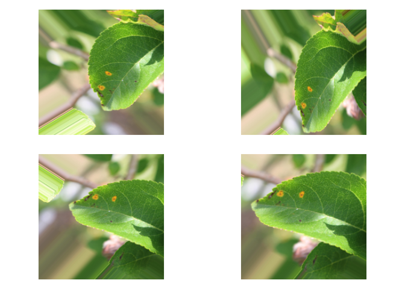
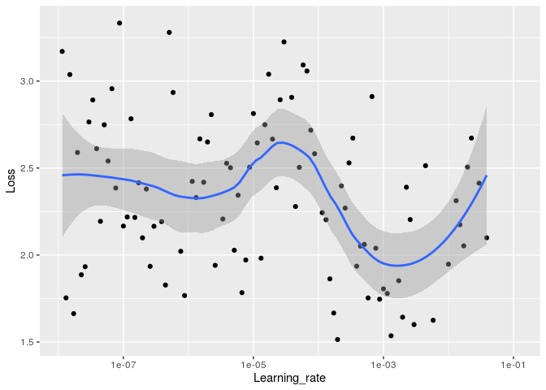
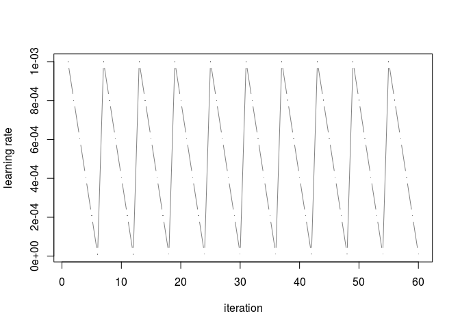
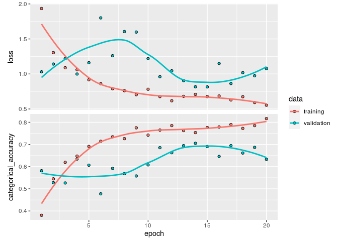
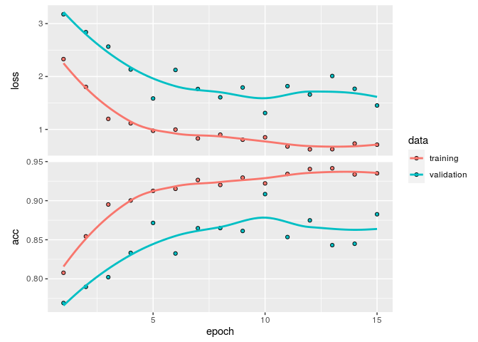

Plant Pathology 2020 - FGVC7 with R and Keras
================

# Keras with R

Long ago, I have learned the basics of deep learning with keras. I got
more used to Fast.ai since then.

But I am a R practitioner and I want to know a framework that I can use
with R. Also, Keras is sometimes required explicity in some job
offers/projects, or for academic research. So in this Rmarkdown
document, I relearn it with the book *Deep Learning with R*. For the
moment my aim is to have something that work from A to Z, and iterate
over it.

The data of this Rmarkdown came from the competition [Plant
Pathology 2020 -
FGVC7](https://www.kaggle.com/c/plant-pathology-2020-fgvc7). In this
notebook I also reimplement a learning rate finder and the one cycle
policy.

## To do list :

  - bigger images
  - load best model after training :heavy\_check\_mark:
  - lr finder :heavy\_check\_mark:
  - add data augmentation :heavy\_check\_mark:
  - plot the data augmentation :heavy\_check\_mark:
  - implement one cycle policy ? :heavy\_check\_mark:
  - visualization of what the convnets learn
  - fine
    tuning

<!-- end list -->

``` r
library(tidyverse)
```

    ## ── Attaching packages ─────────────────────────────────────────────────────────────────────────────────────────────────────── tidyverse 1.3.0 ──

    ## ✓ ggplot2 3.3.0     ✓ purrr   0.3.4
    ## ✓ tibble  3.0.0     ✓ dplyr   0.8.5
    ## ✓ tidyr   1.0.2     ✓ stringr 1.4.0
    ## ✓ readr   1.3.1     ✓ forcats 0.5.0

    ## ── Conflicts ────────────────────────────────────────────────────────────────────────────────────────────────────────── tidyverse_conflicts() ──
    ## x dplyr::filter() masks stats::filter()
    ## x dplyr::lag()    masks stats::lag()

``` r
library(keras)
library(tensorflow)
library(reticulate)
```

``` r
use_python("/usr/bin/python3.5", required = TRUE)
tf <- tensorflow::tf
sess <- tf$Session()
```

## Data augmentation and train generator

``` r
labels<-read_csv('plant-pathology-2020-fgvc7/train.csv')
```

    ## Parsed with column specification:
    ## cols(
    ##   image_id = col_character(),
    ##   healthy = col_double(),
    ##   multiple_diseases = col_double(),
    ##   rust = col_double(),
    ##   scab = col_double()
    ## )

``` r
head(labels)
```

    ## # A tibble: 6 x 5
    ##   image_id healthy multiple_diseases  rust  scab
    ##   <chr>      <dbl>             <dbl> <dbl> <dbl>
    ## 1 Train_0        0                 0     0     1
    ## 2 Train_1        0                 1     0     0
    ## 3 Train_2        1                 0     0     0
    ## 4 Train_3        0                 0     1     0
    ## 5 Train_4        1                 0     0     0
    ## 6 Train_5        1                 0     0     0

``` r
labels$image_id <- paste0(labels$image_id, ".jpg")
```

``` r
head(labels)
```

    ## # A tibble: 6 x 5
    ##   image_id    healthy multiple_diseases  rust  scab
    ##   <chr>         <dbl>             <dbl> <dbl> <dbl>
    ## 1 Train_0.jpg       0                 0     0     1
    ## 2 Train_1.jpg       0                 1     0     0
    ## 3 Train_2.jpg       1                 0     0     0
    ## 4 Train_3.jpg       0                 0     1     0
    ## 5 Train_4.jpg       1                 0     0     0
    ## 6 Train_5.jpg       1                 0     0     0

``` r
set.seed(6)
```

``` r
labels <- labels  %>% mutate(id = row_number())#Check IDs

train_labels <- labels  %>% sample_frac(.90)#Create test set
val_labels <- anti_join(labels, train_labels, by = 'id')
train_labels$id<-NULL
val_labels$id<-NULL
```

``` r
head(train_labels)
```

    ## # A tibble: 6 x 5
    ##   image_id       healthy multiple_diseases  rust  scab
    ##   <chr>            <dbl>             <dbl> <dbl> <dbl>
    ## 1 Train_820.jpg        0                 0     0     1
    ## 2 Train_9.jpg          1                 0     0     0
    ## 3 Train_940.jpg        0                 0     1     0
    ## 4 Train_333.jpg        0                 0     1     0
    ## 5 Train_1719.jpg       0                 0     0     1
    ## 6 Train_611.jpg        0                 0     1     0

``` r
head(val_labels)
```

    ## # A tibble: 6 x 5
    ##   image_id     healthy multiple_diseases  rust  scab
    ##   <chr>          <dbl>             <dbl> <dbl> <dbl>
    ## 1 Train_2.jpg        1                 0     0     0
    ## 2 Train_19.jpg       0                 0     0     1
    ## 3 Train_22.jpg       0                 0     0     1
    ## 4 Train_31.jpg       0                 0     1     0
    ## 5 Train_33.jpg       1                 0     0     0
    ## 6 Train_38.jpg       0                 0     1     0

``` r
summary(train_labels)
```

    ##    image_id            healthy       multiple_diseases      rust       
    ##  Length:1639        Min.   :0.0000   Min.   :0.00000   Min.   :0.0000  
    ##  Class :character   1st Qu.:0.0000   1st Qu.:0.00000   1st Qu.:0.0000  
    ##  Mode  :character   Median :0.0000   Median :0.00000   Median :0.0000  
    ##                     Mean   :0.2794   Mean   :0.05003   Mean   :0.3411  
    ##                     3rd Qu.:1.0000   3rd Qu.:0.00000   3rd Qu.:1.0000  
    ##                     Max.   :1.0000   Max.   :1.00000   Max.   :1.0000  
    ##       scab       
    ##  Min.   :0.0000  
    ##  1st Qu.:0.0000  
    ##  Median :0.0000  
    ##  Mean   :0.3295  
    ##  3rd Qu.:1.0000  
    ##  Max.   :1.0000

``` r
summary(val_labels)
```

    ##    image_id            healthy       multiple_diseases      rust       
    ##  Length:182         Min.   :0.0000   Min.   :0.00000   Min.   :0.0000  
    ##  Class :character   1st Qu.:0.0000   1st Qu.:0.00000   1st Qu.:0.0000  
    ##  Mode  :character   Median :0.0000   Median :0.00000   Median :0.0000  
    ##                     Mean   :0.3187   Mean   :0.04945   Mean   :0.3462  
    ##                     3rd Qu.:1.0000   3rd Qu.:0.00000   3rd Qu.:1.0000  
    ##                     Max.   :1.0000   Max.   :1.00000   Max.   :1.0000  
    ##       scab       
    ##  Min.   :0.0000  
    ##  1st Qu.:0.0000  
    ##  Median :0.0000  
    ##  Mean   :0.2857  
    ##  3rd Qu.:1.0000  
    ##  Max.   :1.0000

``` r
image_path<-'plant-pathology-2020-fgvc7/images/'
```

``` r
#reticulate::virtualenv_install(packages="pandas") 
```

``` r
keras::use_implementation("keras")
keras::use_backend("tensorflow")
```

``` r
reticulate::py_config()
```

    ## python:         /usr/bin/python3.5
    ## libpython:      /usr/lib/python3.5/config-3.5m-x86_64-linux-gnu/libpython3.5m.so
    ## pythonhome:     //usr://usr
    ## version:        3.5.2 (default, Apr 16 2020, 17:47:17)  [GCC 5.4.0 20160609]
    ## numpy:          /home/proprietaire/.local/lib/python3.5/site-packages/numpy
    ## numpy_version:  1.18.3
    ## tensorflow:     /home/proprietaire/.local/lib/python3.5/site-packages/tensorflow
    ## 
    ## NOTE: Python version was forced by use_python function

``` r
#data augmentation
datagen <- image_data_generator(
  rotation_range = 40,
  width_shift_range = 0.2,
  height_shift_range = 0.2,
  shear_range = 0.2,
  zoom_range = 0.2,
  horizontal_flip = TRUE,
  fill_mode = "nearest"
)
```

Plotting to see if it works :

``` r
img_path<-"plant-pathology-2020-fgvc7/images/Train_1000.jpg"

img <- image_load(img_path, target_size = c(224, 224))
img_array <- image_to_array(img)
img_array <- array_reshape(img_array, c(1, 224, 224, 3))
img_array<-img_array/255
# Generated that will flow augmented images
augmentation_generator <- flow_images_from_data(
  img_array, 
  generator = datagen, 
  batch_size = 1 
)
op <- par(mfrow = c(2, 2), pty = "s", mar = c(1, 0, 1, 0))
for (i in 1:4) {
  batch <- generator_next(augmentation_generator)
  plot(as.raster(batch[1,,,]))
}
```

<!-- -->

``` r
par(op)
```

``` r
train_generator <- flow_images_from_dataframe(dataframe = train_labels, 
                                              directory = image_path,
                                              generator = datagen,
                                              class_mode = "other",
                                              x_col = "image_id",
                                              y_col = c("healthy", "multiple_diseases", "rust", "scab"),
                                              target_size = c(224, 224),
                                              batch_size=32)
```

``` r
validation_generator <- flow_images_from_dataframe(dataframe = val_labels, 
                                              directory = image_path,
                                              class_mode = "other",
                                              x_col = "image_id",
                                              y_col = c("healthy", "multiple_diseases", "rust", "scab"),
                                              target_size = c(224, 224),
                                              batch_size=32)
```

``` r
train_generator
```

    ## <keras_preprocessing.image.dataframe_iterator.DataFrameIterator>

``` r
batch<-generator_next(train_generator)
str(batch)
```

    ## List of 2
    ##  $ : num [1:32, 1:224, 1:224, 1:3] 255 59.7 185 89.4 51.8 ...
    ##  $ : num [1:32, 1:4] 0 0 0 0 0 1 0 0 0 1 ...

# Import pre-trained model

How to choose the parameters ? c(224, 224, 3) is the default of Resnet,
came from the default if include\_top is set to
true.

``` r
conv_base <- application_resnet50(weights = 'imagenet', include_top = FALSE, input_shape = c(224, 224, 3))
```

``` r
#conv_base
```

``` r
freeze_weights(conv_base)
```

How to decide to what to add to the conv\_base of a Resnet-50 ? Running
the following allow to look what the Resnet looks like normally
:

``` r
#look <- application_resnet50(weights = 'imagenet', include_top = TRUE, input_shape = c(224, 224, 3))
#look

#________________________________________________________________________________
#conv5_block3_out (Activat (None, 7, 7, 2048 0        conv5_block3_add[0][0]     
#________________________________________________________________________________
#avg_pool (GlobalAveragePo (None, 2048)      0        conv5_block3_out[0][0]     
#________________________________________________________________________________
#probs (Dense)             (None, 1000)      2049000  avg_pool[0][0]             
#================================================================================
```

But it gave quite poor results. Actually I have tried to look in other
kernels, without finding clear consensus. Finally I will add some layer
in a similar way on [how it is done in
fast\_ai](https://docs.fast.ai/vision.learner.html#create_head). Since
there is a “funny” pooling operation, The AdaptiveConcatPool2d (adaptive
average pooling and adaptive max pooling), I will use a max pooling,
because we are most interresting to know if there is a rust or scab,
that something on “average”. After testing, adding a
layer\_global\_average\_pooling\_2d() indeed gave poor results.

One of the most important aspect of deep learning is to set up a good
loss function and last layer activation. Since it is a **multiclass**
and **multi-label** classification (plants can have several diseases), I
will use a **sigmoid** activation for the last layer and a **binary
crossentropy** as the loss function.

``` r
model <- keras_model_sequential() %>% 
        conv_base %>% 
        layer_global_max_pooling_2d() %>% 
        layer_batch_normalization() %>%
        layer_dropout(rate=0.5) %>%
        layer_dense(units=4, activation="sigmoid")
```

``` r
model
```

    ## Model
    ## ________________________________________________________________________________
    ## Layer (type)                        Output Shape                    Param #     
    ## ================================================================================
    ## resnet50 (Model)                    (None, 7, 7, 2048)              23587712    
    ## ________________________________________________________________________________
    ## global_max_pooling2d_1 (GlobalMaxPo (None, 2048)                    0           
    ## ________________________________________________________________________________
    ## batch_normalization_1 (BatchNormali (None, 2048)                    8192        
    ## ________________________________________________________________________________
    ## dropout_1 (Dropout)                 (None, 2048)                    0           
    ## ________________________________________________________________________________
    ## dense_1 (Dense)                     (None, 4)                       8196        
    ## ================================================================================
    ## Total params: 23,604,100
    ## Trainable params: 12,292
    ## Non-trainable params: 23,591,808
    ## ________________________________________________________________________________

## Learning rate finder

Keras force you to ask yourself a lot of question, including the good
learning rate to use. I was not really successfull to do so, so I
reimplement a learning rate finder, based on the code of this [excellent
article](http://thecooldata.com/2019/01/learning-rate-finder-with-cifar10-keras-r/),
but with some change for the the maths [of this article about
fast.ai](https://sgugger.github.io/how-do-you-find-a-good-learning-rate.html)
(for the different learning rate explored in the initial phase).

``` r
LogMetrics <- R6::R6Class("LogMetrics",
  inherit = KerasCallback,
  public = list(
    loss = NULL,
    acc = NULL,
    on_batch_end = function(batch, logs=list()) {
      self$loss <- c(self$loss, logs[["loss"]])
      self$acc <- c(self$acc, logs[["acc"]])
    }
))
```

``` r
callback_lr_init <- function(logs){
      iter <<- 0
      lr_hist <<- c()
      iter_hist <<- c()
}
callback_lr_set <- function(batch, logs){
      iter <<- iter + 1
      LR <- l_rate[iter] # if number of iterations > l_rate values, make LR constant to last value
      if(is.na(LR)) LR <- l_rate[length(l_rate)]
      k_set_value(model$optimizer$lr, LR)
}
callback_lr_log <- function(batch, logs){
      lr_hist <<- c(lr_hist, k_get_value(model$optimizer$lr))
      iter_hist <<- c(iter_hist, k_get_value(model$optimizer$iterations))
}
```

``` r
callback_lr <- callback_lambda(on_train_begin=callback_lr_init, on_batch_begin=callback_lr_set)
callback_logger <- callback_lambda(on_batch_end=callback_lr_log)
callback_log_acc_lr <- LogMetrics$new()
```

After some successfull training for a learning rate between 1e-5 and
1e-3, I extend the plot to a maximum of 0.1.

``` r
lr0<-1e-8
#lr_max<-0.01
lr_max<-0.1

#n_iteration :
n<-120 #from 100 to 120
q<-(lr_max/lr0)^(1/(n-1))
```

``` r
i<-1:n
l_rate<-lr0*(q^i)
plot(l_rate, type="b", pch=16, cex=0.1, xlab="iteration", ylab="learning rate")
```

<!-- -->

``` r
model %>% compile(
    optimizer=optimizer_rmsprop(lr=lr_max),
    loss="binary_crossentropy",
    metrics='accuracy'
)
```

``` r
callback_list = list(callback_lr, callback_logger, callback_log_acc_lr)
```

``` r
history <- model %>% fit_generator(
    train_generator,
    steps_per_epoch=n,
    epochs = 1,
    callbacks = callback_list,
    validation_data = validation_generator,
    validation_step=30
)
```

``` r
data <- data.frame("Learning_rate" = lr_hist, "Loss" = callback_log_acc_lr$loss)
head(data)
```

    ##   Learning_rate      Loss
    ## 1  1.145048e-08 1.0522274
    ## 2  1.311134e-08 0.8919097
    ## 3  1.501311e-08 1.0668702
    ## 4  1.719072e-08 0.9105158
    ## 5  1.968419e-08 0.9442893
    ## 6  2.253934e-08 1.0720690

Learning rate vs loss
:

``` r
ggplot(data, aes(x=Learning_rate, y=Loss)) + scale_x_log10() + geom_point() +  geom_smooth(span = 0.5)
```

    ## `geom_smooth()` using method = 'loess' and formula 'y ~ x'

<!-- -->

More centered on the moment when the slope goes down :

``` r
limits<-quantile(data$Loss, probs = c(0.10, 0.90))
ggplot(data, aes(x=Learning_rate, y=Loss)) + scale_x_log10() + 
scale_y_continuous(name="Loss", limits=limits)+ geom_point() +  geom_smooth(span = 0.5)
```

    ## `geom_smooth()` using method = 'loess' and formula 'y ~ x'

    ## Warning: Removed 24 rows containing non-finite values (stat_smooth).

    ## Warning: Removed 24 rows containing missing values (geom_point).

<!-- -->

Based on this graph I would go on a base\_lr=1e-5, and a max lr of 1e-3.

# Training

## Training with cyclic lr

After the improvement of the performance the neural net (by setting the
right loss/activation of the last layer), it is time to focus a bit on
the cyclic Learning Rate. Most of the code below came [from the cool
data](http://thecooldata.com/2019/01/learning-rate-finder-with-cifar10-keras-r/).
In contrast to the previous version (mode=‘exp\_range’, gamma=0.99), I
will first try follow the guidelines from [The 1cycle
policy](https://sgugger.github.io/the-1cycle-policy.html), by setting
the learning rate into in a triangular mode (**NB**, without having the
learning rate decreasing more than the minimum at the end of the cycle).

``` r
####################
Cyclic_LR <- function(iteration=1:32000, base_lr=1e-5, max_lr=1e-3, step_size=2000, mode='triangular', gamma=1, scale_fn=NULL, scale_mode='cycle'){ # translated from python to R, original at: https://github.com/bckenstler/CLR/blob/master/clr_callback.py # This callback implements a cyclical learning rate policy (CLR). # The method cycles the learning rate between two boundaries with # some constant frequency, as detailed in this paper (https://arxiv.org/abs/1506.01186). # The amplitude of the cycle can be scaled on a per-iteration or per-cycle basis. # This class has three built-in policies, as put forth in the paper. # - "triangular": A basic triangular cycle w/ no amplitude scaling. # - "triangular2": A basic triangular cycle that scales initial amplitude by half each cycle. # - "exp_range": A cycle that scales initial amplitude by gamma**(cycle iterations) at each cycle iteration. # - "sinus": A sinusoidal form cycle # # Example # > clr <- Cyclic_LR(base_lr=0.001, max_lr=0.006, step_size=2000, mode='triangular', num_iterations=20000) # > plot(clr, cex=0.2)
 
      # Class also supports custom scaling functions with function output max value of 1:
      # > clr_fn <- function(x) 1/x # > clr <- Cyclic_LR(base_lr=0.001, max_lr=0.006, step_size=400, # scale_fn=clr_fn, scale_mode='cycle', num_iterations=20000) # > plot(clr, cex=0.2)
 
      # # Arguments
      #   iteration:
      #       if is a number:
      #           id of the iteration where: max iteration = epochs * (samples/batch)
      #       if "iteration" is a vector i.e.: iteration=1:10000:
      #           returns the whole sequence of lr as a vector
      #   base_lr: initial learning rate which is the
      #       lower boundary in the cycle.
      #   max_lr: upper boundary in the cycle. Functionally,
      #       it defines the cycle amplitude (max_lr - base_lr).
      #       The lr at any cycle is the sum of base_lr
      #       and some scaling of the amplitude; therefore 
      #       max_lr may not actually be reached depending on
      #       scaling function.
      #   step_size: number of training iterations per
      #       half cycle. Authors suggest setting step_size
      #       2-8 x training iterations in epoch.
      #   mode: one of {triangular, triangular2, exp_range, sinus}.
      #       Default 'triangular'.
      #       Values correspond to policies detailed above.
      #       If scale_fn is not None, this argument is ignored.
      #   gamma: constant in 'exp_range' scaling function:
      #       gamma**(cycle iterations)
      #   scale_fn: Custom scaling policy defined by a single
      #       argument lambda function, where 
      #       0 <= scale_fn(x) <= 1 for all x >= 0.
      #       mode paramater is ignored 
      #   scale_mode: {'cycle', 'iterations'}.
      #       Defines whether scale_fn is evaluated on 
      #       cycle number or cycle iterations (training
      #       iterations since start of cycle). Default is 'cycle'.
 
      ########
      if(is.null(scale_fn)==TRUE){
            if(mode=='triangular'){scale_fn <- function(x) 1; scale_mode <- 'cycle';}
            if(mode=='triangular2'){scale_fn <- function(x) 1/(2^(x-1)); scale_mode <- 'cycle';}
            if(mode=='exp_range'){scale_fn <- function(x) gamma^(x); scale_mode <- 'iterations';}
            if(mode=='sinus'){scale_fn <- function(x) 0.5*(1+sin(x*pi/2)); scale_mode <- 'cycle';}
            if(mode=='halfcosine'){scale_fn <- function(x) 0.5*(1+cos(x*pi)^2); scale_mode <- 'cycle';}
      }
      lr <- list()
      if(is.vector(iteration)==TRUE){
            for(iter in iteration){
                  cycle <- floor(1 + (iter / (2*step_size)))
                  x2 <- abs(iter/step_size-2 * cycle+1)
                  if(scale_mode=='cycle') x <- cycle
                  if(scale_mode=='iterations') x <- iter
                  lr[[iter]] <- base_lr + (max_lr-base_lr) * max(0,(1-x2)) * scale_fn(x)
            }
      }
      lr <- do.call("rbind",lr)
      return(as.vector(lr))
}
```

``` r
n=40
nb_epochs=10
n_iter<-n*nb_epochs
```

``` r
l_rate <- Cyclic_LR(iteration=1:n_iter, base_lr=1e-5, max_lr=1e-3, step_size=floor(n/2),
                        mode='triangular', gamma=1, scale_fn=NULL, scale_mode='cycle')
```

``` r
plot(l_rate, type="b", pch=16, xlab="iteration", cex=0.2, ylab="learning rate", col="grey50")
```

<!-- -->

#### Reproducing cosine annealing

``` r
l_rate <- Cyclic_LR(iteration=1:n_iter, base_lr=1e-5, max_lr=1e-3, step_size=floor(n),
                        mode='halfcosine', gamma=1, scale_fn=NULL, scale_mode='cycle')

l_rate <- rep(l_rate[n:(n*2)], nb_epochs)
```

``` r
plot(l_rate, type="b", pch=16, xlab="iteration", cex=0.2, ylab="learning rate", col="grey50")
```

<!-- -->

##### Combining the two

``` r
l_rate_cyclical <- Cyclic_LR(iteration=1:n, base_lr=1e-5, max_lr=1e-3, step_size=floor(n/2),
                        mode='triangular', gamma=1, scale_fn=NULL, scale_mode='cycle')


l_rate_cosine_annealing <- Cyclic_LR(iteration=1:n_iter, base_lr=1e-5, max_lr=1e-3, step_size=floor(n),
                        mode='halfcosine', gamma=1, scale_fn=NULL, scale_mode='cycle')

l_rate_cosine_annealing <- rep(l_rate_cosine_annealing[n:(n*2)])

l_rate <- rep(c(l_rate_cyclical, l_rate_cosine_annealing), nb_epochs/2)
```

``` r
plot(l_rate, type="b", pch=16, xlab="iteration", cex=0.2, ylab="learning rate", col="grey50")
```

<!-- -->

Clean model for training :

``` r
model <- keras_model_sequential() %>% 
        conv_base %>% 
        layer_global_max_pooling_2d() %>% 
        layer_batch_normalization() %>%
        layer_dropout(rate=0.5) %>%
        layer_dense(units=4, activation="sigmoid")
```

#### Saving all models

``` r
model %>% compile(
    optimizer=optimizer_rmsprop(lr=1e-5),
    loss="binary_crossentropy",
    metrics = "accuracy"
)
```

The following code [came from the tutorial of Keras here,
“tutorial\_save\_and\_restore”](https://keras.rstudio.com/articles/tutorial_save_and_restore.html).

``` r
checkpoint_dir <- "checkpoints"
unlink(checkpoint_dir, recursive = TRUE)
dir.create(checkpoint_dir)
filepath <- file.path(checkpoint_dir, "weights.{epoch:02d}.hdf5")
```

``` r
check_point_callback <- callback_model_checkpoint(
  filepath = filepath,
  save_weights_only = TRUE,
  save_best_only = FALSE,
  verbose = 1
)
```

    ## Warning in callback_model_checkpoint(filepath = filepath, save_weights_only
    ## = TRUE, : The save_freq argument is only used by TensorFlow >= 1.14. Update
    ## TensorFlow or use save_freq = NULL

``` r
callback_list<-list(callback_lr, #callback to update lr
                    check_point_callback) #callback to save model
```

``` r
history <- model %>% fit_generator(
    train_generator,
    steps_per_epoch=n,
    epochs = nb_epochs,
    callbacks = callback_list, #callback to update cylic lr
    validation_data = validation_generator,
    validation_step=50
)
```

``` r
plot(history)
```

    ## `geom_smooth()` using formula 'y ~ x'

<!-- -->

### Loading best model

``` r
#model<-load_model_hdf5("raw_model.h5")
list.files(checkpoint_dir)
```

    ##  [1] "weights.01.hdf5" "weights.02.hdf5" "weights.03.hdf5" "weights.04.hdf5"
    ##  [5] "weights.05.hdf5" "weights.06.hdf5" "weights.07.hdf5" "weights.08.hdf5"
    ##  [9] "weights.09.hdf5" "weights.10.hdf5"

``` r
model %>% load_model_weights_hdf5(
  file.path(checkpoint_dir,"weights.05.hdf5")
)
```

### About the learning rate

Based on the previous graph, I used a learning rate of 1e-3. The article
[The 1cycle policy](https://sgugger.github.io/the-1cycle-policy.html),
mentionned that we can use a bigger learning rate as a regularizer, but
a maximum learning rate of 5e-3 gave average results in my my previous
attempt :


## Fine tuning

### Unfreezing the model

Following line to got the name of the layer we want to unfreeze
(res5a\_branch2a)

``` r
#summary(conv_base)
```

[See this link to
see](https://keras.rstudio.com/reference/freeze_layers.html) that it
works to unfreeze conv\_base independently of the sequential
    model.

``` r
unfreeze_weights(conv_base, from="res5a_branch2a")
```

``` r
summary(model)
```

    ## ________________________________________________________________________________
    ## Layer (type)                        Output Shape                    Param #     
    ## ================================================================================
    ## resnet50 (Model)                    (None, 7, 7, 2048)              23587712    
    ## ________________________________________________________________________________
    ## global_max_pooling2d_2 (GlobalMaxPo (None, 2048)                    0           
    ## ________________________________________________________________________________
    ## batch_normalization_2 (BatchNormali (None, 2048)                    8192        
    ## ________________________________________________________________________________
    ## dropout_2 (Dropout)                 (None, 2048)                    0           
    ## ________________________________________________________________________________
    ## dense_2 (Dense)                     (None, 4)                       8196        
    ## ================================================================================
    ## Total params: 8,628,100
    ## Trainable params: 12,292
    ## Non-trainable params: 8,615,808
    ## ________________________________________________________________________________

### Learning rate finder for unfreezed model

``` r
callback_list = list(callback_lr, callback_logger, callback_log_acc_lr)
```

Here I create a copy for the lr\_finder, to spare the real model.

``` r
model_lr_finder<-model
```

``` r
lr0<-1e-8
lr_max<-0.1

#n_iteration :
n<-120
q<-(lr_max/lr0)^(1/(n-1))
i<-1:n
l_rate<-lr0*(q^i)
```

``` r
i<-1:n
l_rate<-lr0*(q^i)
```

``` r
history <- model_lr_finder %>% fit_generator(
    train_generator,
    steps_per_epoch=n,
    epochs = 1,
    callbacks = callback_list,
    validation_data = validation_generator,
    validation_step=50
)
```

``` r
data <- data.frame("Learning_rate" = lr_hist, "Loss" = callback_log_acc_lr$loss)
head(data)
```

    ##   Learning_rate      Loss
    ## 1  1.145048e-08 1.0522274
    ## 2  1.311134e-08 0.8919097
    ## 3  1.501311e-08 1.0668702
    ## 4  1.719072e-08 0.9105158
    ## 5  1.968419e-08 0.9442893
    ## 6  2.253934e-08 1.0720690

Learning rate vs loss
:

``` r
ggplot(data, aes(x=Learning_rate, y=Loss)) + scale_x_log10() + geom_point() +  geom_smooth(span = 0.5)
```

    ## `geom_smooth()` using method = 'loess' and formula 'y ~ x'

<!-- -->

### Training

``` r
n=40
nb_epochs=15
n_iter<-n*nb_epochs
```

``` r
l_rate_cyclical <- Cyclic_LR(iteration=1:n, base_lr=1e-6, max_lr=(1e-3)/5, step_size=floor(n/2),
                        mode='triangular', gamma=1, scale_fn=NULL, scale_mode='cycle')


l_rate_cosine_annealing <- Cyclic_LR(iteration=1:n_iter, base_lr=1e-6, max_lr=(1e-3)/5, step_size=floor(n),
                        mode='halfcosine', gamma=1, scale_fn=NULL, scale_mode='cycle')

l_rate_cosine_annealing <- rep(l_rate_cosine_annealing[n:(n*2)])

l_rate <- rep(c(l_rate_cyclical, l_rate_cosine_annealing), nb_epochs/2)
```

``` r
plot(l_rate, type="b", pch=16, xlab="iteration", cex=0.2, ylab="learning rate", col="grey50")
```

<!-- -->

``` r
model %>% compile(
    optimizer=optimizer_rmsprop(lr=1e-5),
    loss="binary_crossentropy",
    metrics = "accuracy"
)
```

``` r
cp_callback <- callback_model_checkpoint(
  filepath = filepath,
  save_weights_only = FALSE,
  verbose = 1
)
```

    ## Warning in callback_model_checkpoint(filepath = filepath, save_weights_only
    ## = FALSE, : The save_freq argument is only used by TensorFlow >= 1.14. Update
    ## TensorFlow or use save_freq = NULL

``` r
filepath <- file.path(checkpoint_dir, "Resnet_{epoch:02d}.hdf5")
```

``` r
callback_list<-list(callback_lr, #callback to update lr
                      cp_callback)
```

``` r
history <- model %>% fit_generator(
    train_generator,
    steps_per_epoch=n,
    epochs = nb_epochs,
    callbacks = callback_list, #callback to update cylic lr
    validation_data = validation_generator,
    validation_step=50
)
```

``` r
plot(history)
```

    ## `geom_smooth()` using formula 'y ~ x'

<!-- -->

``` r
list.files("checkpoints/")
```

    ##  [1] "weights.01.hdf5" "weights.02.hdf5" "weights.03.hdf5" "weights.04.hdf5"
    ##  [5] "weights.05.hdf5" "weights.06.hdf5" "weights.07.hdf5" "weights.08.hdf5"
    ##  [9] "weights.09.hdf5" "weights.10.hdf5" "weights.11.hdf5" "weights.12.hdf5"
    ## [13] "weights.13.hdf5" "weights.14.hdf5" "weights.15.hdf5"
